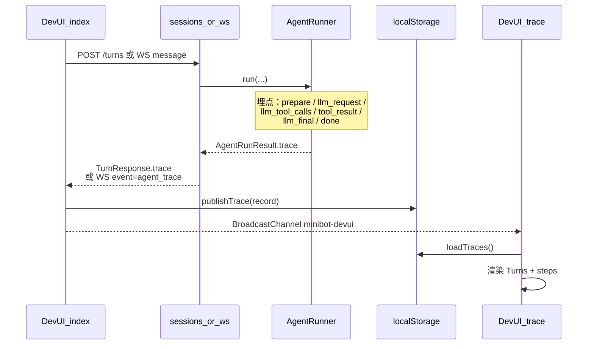

# Dev UI Trace 数据链路

> 回答：`http://127.0.0.1:8766/ui/trace.html` 的数据从哪来？  
> **结论：不直接打 API。** 埋点在 `AgentRunner`，经 REST/WS 回到聊天页，再写入浏览器 `localStorage` + `BroadcastChannel`，Trace 页只读本地。

## 总览



## 1. 埋点起点：`AgentRunner.run`

文件：[`minibot/src/minibot/agent/runner.py`](../minibot/src/minibot/agent/runner.py)

每跑一轮 ReAct，往 `trace: list[dict]` 追加步骤：

| `type` | 何时写入 | 关键字段 |
|--------|----------|----------|
| `prepare` | 进循环前 | `messages` 快照、`tool_names` |
| `llm_request` | 调 `provider.chat` **之前** | `ts`、`iteration`、送入的 `messages` |
| `llm_tool_calls` | 模型要调工具 | `ts`、`request_ts`、`duration_ms`、工具参数 |
| `tool_result` | `tools.execute` 之后 | 工具返回 |
| `llm_final` | 模型给出最终文本 | `ts`、`request_ts`、`duration_ms`、`content` |
| `llm_error` | provider 报错 | 同上耗时字段 |
| `done` | 本轮结束 | `stop_reason`、`tools_used` |

耗时：`duration_ms ≈ Date(llm_final.ts) − Date(llm_request.ts)`（同一次 `iteration`）。

返回：`AgentRunResult(trace=...)`。

## 2. 出站：HTTP / WebSocket 带上 `trace`

**REST**

[`api/routes/sessions.py`](../minibot/src/minibot/api/routes/sessions.py) → `POST /api/sessions/{id}/turns`

```text
TurnResponse { content, tools_used, stop_reason, messages, trace }
```

**WebSocket**

[`api/ws.py`](../minibot/src/minibot/api/ws.py) 在助手 `message` 之后额外发：

```json
{
  "event": "agent_trace",
  "chat_id": "...",
  "trace": [ ... ],
  "stop_reason": "...",
  "tools_used": []
}
```

## 3. 聊天页写入本地：`publishTrace`

文件：[`static/devui/index.html`](../minibot/src/minibot/static/devui/index.html) + [`common.js`](../minibot/src/minibot/static/devui/common.js)

- REST：`pushTrace({ ...res, source: "rest" })`
- WS：收到 `agent_trace` → `pushTrace({ trace, source: "ws", ... })`

`publishTrace` 做两件事：

1. **`localStorage["minibot-devui-traces"]`** 写入最近最多 40 条 turn 记录  
2. **`BroadcastChannel("minibot-devui")`** 广播 `{ type: "trace", record }`，通知已打开的 Trace 标签页

单条 record 形状：

```js
{
  id, at, sessionId, userText, content,
  stopReason, toolsUsed, source,  // "rest" | "ws"
  trace: [ /* runner 的步骤数组 */ ]
}
```

## 4. Trace 页如何拿到数据

文件：[`static/devui/trace.html`](../minibot/src/minibot/static/devui/trace.html)

| 时机 | 行为 |
|------|------|
| 打开 / 刷新 | `loadTraces()` 读 `localStorage` |
| 聊天页刚发完消息（两页同开） | `onTraceEvent` 收到 BroadcastChannel，立刻刷新 |
| 其它标签改了 storage | `window.storage` 事件再 `loadTraces()` |

**没有** `GET /api/.../trace`。关浏览器 / 清站点数据会丢；换设备也不会同步。

## 5. 和 Phase 10 Langfuse 的关系

| | Dev UI Trace（现在） | Langfuse（计划末尾） |
|--|---------------------|----------------------|
| 埋点源 | 同一套 `runner.trace` | 建议复用/映射这些步骤 |
| 传输 | 响应体 → 浏览器本地 | SDK → Langfuse 服务 |
| 用途 | 本机开发即时看 | 跨会话 / 生产可观测 |

## 调试检查清单

1. 重启 `minibot`，打开 `/ui/` 与 `/ui/trace.html`  
2. 聊天页发一句（可让它调 `get_weather`）  
3. 聊天页 Event log 应出现 `trace published · N steps`  
4. Trace 页左侧出现新 Turn；`llm_final` 右侧有红色耗时徽章  
5. DevTools → Application → Local Storage → `minibot-devui-traces`
