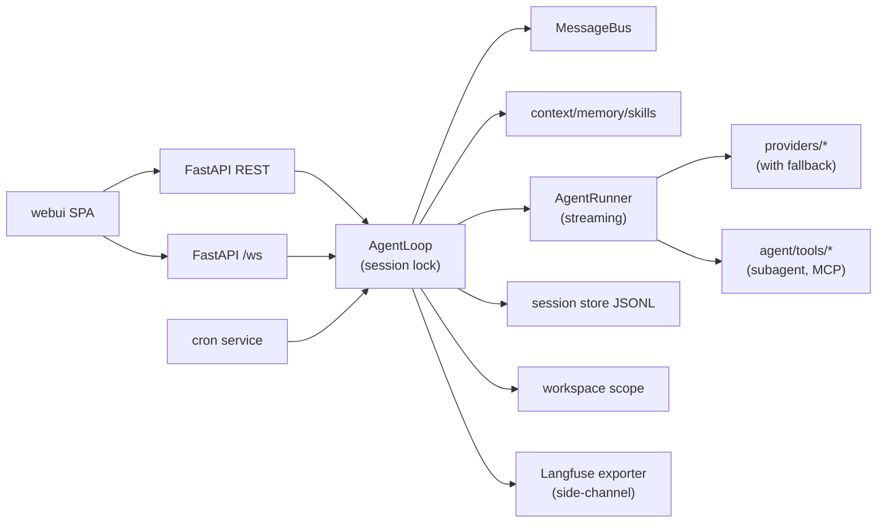
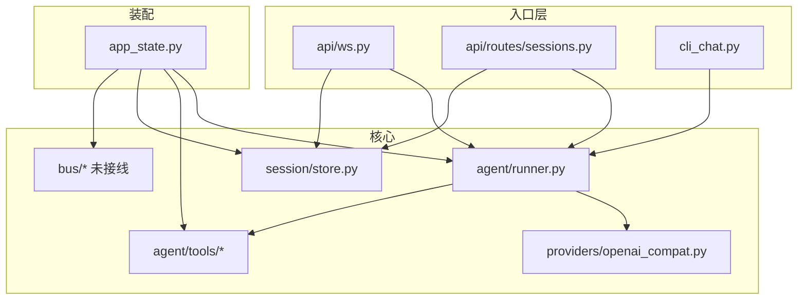

# minibot FastAPI 迁移 — 可执行 Plan（v3.6）

> **落盘路径：** [`docs-plan/minibot-fastapi-migration.md`](./minibot-fastapi-migration.md)
> **范围锁定：** 在 `minibot/` **重写** WebUI/Gateway 后端（以 `nanobot/` 为行为参照，不长期 `import nanobot`）。
> **v3 合并（2026-07-24）**：本文件合并了 v2 路线图 + 原 `minibot-core-impact.md` 的模块影响矩阵，成为**唯一可执行主文档**。每个 Phase 同时包含：目标 / 子步骤 / **模块影响表** / **对核心链路影响等级** / 验收。
> **v3.1–v3.4**：Dev UI 约定、学习优先、Composer UX backlog、Phase 1 主线锁定（见文末版本表）。
> **v3.5（2026-07-26）**：插队完成 Phase 3a/3b/5/6a；MCP Insight UI（模板 + Invoke + pipeline）。
> **v3.6（2026-07-26）**：**Checklist 重排**——已实现置顶；未实现按新优先级排序（见 [Phase checklist](#phase-checklist)）。
> **配套：**
> - 现状基线：[`minibot-current-status.md`](./minibot-current-status.md)
> - Phase 短计划：见 §短计划清单 / `docs-plan/phase-*.md`

---

## 核心原则（置顶 · 高于一切交付节奏）

> **本仓库的第一目标不是「赶完 minibot」，而是通过亲手实现与可视化，深刻理解 Agent 如何运转。**  
> 功能完成度是副产品；**理解**才是主产物。任何与此冲突的「快点合完」都应让路。

### 1. 学习优先（Learning-first）

| | |
|--|--|
| **是什么** | minibot 是一座可拆开的 agent 实验室：ReAct、session、lock、bus、tool、stream、compaction… 每一块都要能被看见、被追问、被亲手破坏再修好。 |
| **不是什么** | 不是单纯的产品交付清单；不是「对齐 nanobot 功能百分比」的 KPI 竞赛。 |
| **做决策时** | 若两个方案里，A 更快上线、B 更能讲清「为什么这样设计」——**选 B**（除非安全/数据丢失硬约束）。 |
| **验收时** | 问自己：离开代码，我能否用 2 分钟向别人讲清本 Phase 解决的问题、正常长什么样、坏了长什么样？讲不清 = 未完成。 |

### 2. 每个 Phase 必须有「正常 + 异常」可视化（Insight UI）

| | |
|--|--|
| **正常路径** | 展示本 Phase 在健康运行时的关键状态 / 产物（例如：session 文件列表、lock idle、trace 逐步成功）。 |
| **异常 / 破坏路径** | 展示**不加该能力会怎样**或**失败时怎样**（例如：0.2 的 Race Demo 无锁 lost-update；工具被 SSRF/workspace 拒绝；流式断线；fallback 切换）。只绿不红 = 理解不完整。 |
| **粒度** | 每个 Phase（及有感知价值的子步骤）至少各有一块可点开的 UI；优先扩展现有 `/ui` 页，必要时新建。 |
| **DoD** | 阶段末必须能演示：① 正常 happy path；② 至少一个异常/对照场景。单测绿但「看不见」→ **不算完成**。 |

**范例（已落地，可作为后续 Phase 标杆）：**

- 0.1：`session-files.html`（正常：磁盘 JSONL 存在）
- 0.2：`runtime.html`（正常：lock）+ `race.html`（异常：无锁破坏对照）
- 0.3：`runtime.html`（正常：`entry_path=loop` + rest/ws/cli/dev 计数）+ `race.html` unsafe（异常：绕过 Loop 直写）
- 0.4：`runtime.html`（正常：Bus 深度/时间线）+ 暂停消费者堆积（异常）
- 0.5：Chat/runtime 展示 `workspace_path`（正常）+ 非法路径拒绝（异常）
- 0.6：`trace.html` timing/usage（正常）+ 无 usage 显示 —（异常）

后续每个 Phase 写计划时，**必须在表格里同时写清「正常 UI」与「异常 UI」两行**，不可只写功能改动。

---

## 目录

1. [核心原则（置顶）](#核心原则置顶--高于一切交付节奏)
2. [Goal](#goal)
3. [Architecture](#architecture)
4. [Global Constraints](#global-constraints)
5. [核心模块 ID 与稳定度](#核心模块-id-与稳定度)
6. [影响等级约定](#影响等级约定)
7. [MSV：最小可切换版本机制](#msv最小可切换版本机制)
8. [Current baseline（已有）](#current-baseline已有)
9. [Testing Infrastructure（前置）](#testing-infrastructure前置)
10. [Dev UI 可视化约定](#dev-ui-可视化约定)
11. [Chat Composer UX 对标（Claude / Cursor）](#chat-composer-ux-对标claude--cursor)（含 [当前执行顺序](#当前执行顺序v36)）
12. [Phase 详解 0–14](#phase-详解)
13. [模块生命周期总览](#模块生命周期总览)
14. [Target package layout（终态）](#target-package-layout终态)
15. [短计划清单](#短计划清单)
16. [Phase checklist](#phase-checklist)
17. [执行方式建议](#执行方式建议)

---

## Goal

用 [`minibot/`](../minibot/) 的 FastAPI runtime 完整承接本地 WebUI 所需的后端能力，使 `webui/` 可默认只打 minibot（`:8766`），并最终让 `nanobot gateway` 的 WebUI 路径可退役；IM 若仍需要可暂时继续跑 legacy gateway。

**与置顶原则的关系：** 上述产品目标是迁移的「外形」；真正的成功标准是——作者对 agent 链路的理解深度是否因本项目而显著提升（见 [核心原则](#核心原则置顶--高于一切交付节奏)）。

**明确不做（本期）**：IM channels、CLI 全家桶、Python SDK、WhatsApp bridge、Desktop 切流（仅在最后 Phase 里留 follow-up）。

**多用户 / Pairing** 移到 Phase 14 作为**最低优先级独立评估**，不承诺时间。

---

## Architecture



- **入口：** [`minibot/src/minibot/main.py`](../minibot/src/minibot/main.py) + [`app_state.py`](../minibot/src/minibot/app_state.py)
- **合同：** [`docs/server-api.md`](../docs/server-api.md)、[`docs/webui-api-surface.md`](../docs/webui-api-surface.md)、[`docs/websocket.md`](../docs/websocket.md)
- **参照实现（只读抄行为，不依赖）：** `nanobot/webui/*`、`nanobot/channels/websocket.py`、`nanobot/agent/*`、`nanobot/session/*`、`nanobot/cron/*`
- **配置：** 继续 `MINIBOT_SERVER_*` + `~/.minibot/`；Phase 6 附带**一次性从 `~/.nanobot/config.json` 导入**（升级为刚需）

---

## Global Constraints

- Python 3.11+、asyncio、FastAPI + uvicorn；包布局保持 `minibot/src/minibot/`
- 禁止长期依赖 `nanobot` 包；允许对照源码移植
- WebUI 写操作优先 **JSON REST**，不回退 legacy GET-mutation
- 安全边界与 nanobot 对齐：workspace 路径守卫、SSRF（web_fetch）、shell sandbox
- 每阶段结束：`cd minibot && pytest` 绿 + 对照 [`docs/server.md`](../docs/server.md) 更新迁移表
- 默认端口 **8766**；不抢 legacy `8765`
- **每个 Phase 必须标注 MSV 位**（见下）
- **学习优先 + Insight UI**（见 [核心原则](#核心原则置顶--高于一切交付节奏)）：每个 Phase 须有正常路径与异常/破坏路径可视化；单测绿但「看不见」不算完成
- **每个 Phase / 有感知价值的子步骤必须带 Dev UI 可视化**（细则见 [Dev UI 可视化约定](#dev-ui-可视化约定)）；纯文档 Phase（如 9）可只加说明链接

---

## 核心模块 ID 与稳定度

**当前基线拓扑：**



**模块 ID 定义**（后续每 Phase 的影响表都会引用）：

| 模块 ID | 路径 | 现状职责 | 稳定度 |
|---------|------|----------|--------|
| **M-AS** | `app_state.py` | DI：bus/sessions/tools/runner/config | 中（每 Phase 都会碰） |
| **M-Bus** | `bus/events.py`, `bus/queue.py` | 队列已有，无人消费 | 低（待接线） |
| **M-Loop** | `agent/loop.py` | **不存在** | — |
| **M-Runner** | `agent/runner.py` | ReAct：LLM ↔ tools | 高（Phase 2 前尽量不动） |
| **M-Tools** | `agent/tools/*` | echo + weather + registry | 中 |
| **M-Prov** | `providers/*` | 仅 OpenAI-compat 非流式 | 中 |
| **M-Sess** | `session/store.py` | 内存 SessionStore | 中（Phase 0 换实现） |
| **M-API** | `api/ws.py`, `api/routes/*` | 直调 `state.runner.run` | 高风险改动点 |
| **M-Cfg** | `config/*` | settings + `~/.minibot/config.json` | 高 |
| **M-Sec** | `security/*` | **不存在** | — |
| **M-Cron** | `cron/*` | **不存在** | — |
| **M-Ctx** | `agent/context.py` 等 | **不存在**（system 写死在 AS） | — |
| **M-Ws** | `workspace/*` (逻辑分散) | **不存在**（一等字段待引入） | — |
| **M-Goal** | `session/goal_state.py` | **不存在** | — |
| **M-Obs** | `observability/*` | **不存在** | — |

---

## 影响等级约定

| 标记 | 含义 |
|------|------|
| 🆕 **新建** | 新文件/新子系统 |
| 🔧 **改实现** | 内部换血，对外 API 尽量兼容 |
| ⚠️ **改合同** | 函数签名 / 事件形状 / REST 字段变化 |
| 🔌 **接线** | 调用关系改道（例如不再直调 runner） |
| — **不动** | 本步不碰 |

**对核心链路影响**（`message → Runner → LLM` 热路径）：

| 等级 | 含义 |
|------|------|
| 🟢 无 | 不涉及热路径 |
| 🟡 低 | 增量扩展，可回滚 |
| 🟠 中 | 调用栈或数据结构变化，需回归 |
| 🔴 高 | 合同变更，前后端联动风险 |

---

## MSV：最小可切换版本机制

每个 Phase 标注一个 MSV 号。**MSV** = 允许 `webui` 默认打 minibot 的最低门槛。

- **MSV=2**（流式）+ **MSV=6**（多 provider）：可以给"本地 coding agent 玩家"切换
- **MSV=9**：正式默认切换、legacy WebUI 路径 deprecated
- **MSV=10-14**：可选强化，不阻塞切换

---

## Current baseline（启动时快照 · 历史）

> 下表是迁移**起步时**的骨架描述，**不代表当前进度**。现行完成度以 [Phase checklist](#phase-checklist) 为准。

| 能力 | 起步位置 |
|------|------|
| Health / bootstrap / 轻量 auth | `api/routes/auth.py`, `api/deps.py` |
| Sessions REST + sync turns | `api/routes/sessions.py`, `session/store.py` |
| WS / Bus / Loop | `api/ws.py`, `bus/*`, `agent/loop.py` |
| Tools + security + MCP | `agent/tools/*`, `security/*` |
| OpenAI-compat + model presets | `providers/openai_compat.py`, `config/presets.py` |
| Memory / skills / context | `agent/memory.py`, `agent/skills.py`, `agent/context.py` |

详见 [`minibot-current-status.md`](./minibot-current-status.md)（若与 checklist 冲突，以 checklist 为准）。

---

## Testing Infrastructure（前置） ✅

**不算独立 Phase，但必须在 Phase 0 前先立好**。避免每个 subagent 各造轮子。

- [x] **Provider mock**：`minibot/tests/fake_provider.py`（`FakeProvider` + `text_response` / `tool_response` / `streaming_text`）
- [x] **Trace / stream fixtures**：`minibot/tests/conftest.py` → `fake_trace` / `fake_streaming_response` / `fake_provider`
- [x] **Session tmp**：`data_dir` fixture（`MINIBOT_SERVER_DATA_DIR` + settings cache clear）；`client` 注入 FakeProvider
- [x] **WS 断言 helper**：`assert_ws_events(received, [("delta", {...}), ...])`
- [x] **并发压力 helper**：`run_concurrent` / `assert_same_session_serialized`（Phase 0.2 接 lock 时用）

---

## Dev UI 可视化约定

**动机：** 单测证明「代码对」；Dev UI 证明「人能看见它在干活」——且能看见**坏掉时什么样**。服从置顶 [核心原则](#核心原则置顶--高于一切交付节奏)：理解优先于赶工。

每个 Phase 交付时，作者应能打开 `/ui`，用约 1 分钟演示：**正常路径 + 至少一个异常/对照路径**。

### 硬性 DoD（Definition of Done）

每个 Phase（及标注了 **Dev UI** 的子步骤）结束时必须同时满足：

1. **正常路径看得见**：有页面或面板展示本 Phase 健康运行时的关键状态 / 产物
2. **异常路径看得见**：有对照、破坏演示、失败态或拒绝态 UI（缺一不可；参照 0.2 `race.html`）
3. **可刷新**：状态来自后端 API（`/api/dev/*` 或现有 REST），不是写死在 HTML 里
4. **有入口**：Chat 顶栏或页内导航能点到
5. **有单测**：至少覆盖「API 返回形状」+「静态页可 200 打开」（参照 `test_dev_session_files_api` / `test_race_demo`）
6. **计划表格双行**：本 Phase 须写明 **正常 UI** 与 **异常 UI**（可同页两区）

### 设计原则（防 UI 膨胀，但不牺牲异常面）

| 原则 | 说明 |
|------|------|
| **正常 + 异常成对** | 只有 happy path 的可视化 = DoD 未满足 |
| **优先扩展现有页** | Trace / Chat / Session Files / Runtime；能加面板就不新开页 |
| **一 Phase 最多 1～2 个新页** | 正常与异常可同页分区（推荐）；正交能力才拆页 |
| **破坏演示隔离** | 异常 UI 可写生产状态，但须明确标注 Dev-only；优先可重复、可离线（模拟延迟/假数据） |
| **只读 introspection 为主** | `/api/dev/*` 默认只读；删除/破坏类操作须确认文案 |
| **名字表意** | `session-files.html`、`runtime.html`、`race.html` |
| **轻量** | 主线阶段：纯静态 HTML + `common.js`（阶段 A 减负）。**正式 UI 框架**见延期计划 [`devui-nextjs-migration.md`](./devui-nextjs-migration.md)（优先级最低） |
| **中文可感知** | 标题/提示说明「你在看什么 / 坏了意味着什么」 |

### 已有 / 规划页一览（随 Phase 勾选）

| 页面 | Phase | 状态 | 一眼看懂什么 |
|------|-------|------|--------------|
| `/ui/` Chat | baseline → UX backlog | ✅（+ **Context usage**） | 会话、发消息、settings；composer 进度环看上下文占用 |
| `/ui/trace.html` | baseline → 0.6/2/6.5 | ✅（**0.6** timing/usage） | Agent 逐步 trace；`t_start`/`t_end`/usage |
| `/ui/session-files.html` | **0.1** | ✅ | `sessions/` 目录 + `*.jsonl` 文件名 |
| `/ui/runtime.html` | **0.2–0.4** | ✅（0.2 lock；0.3 entry；**0.4 bus**） | Loop 入口、session lock、Bus、最近 turn |
| `/ui/race.html` | **0.2** | ✅ | 无锁破坏 vs 有锁对照（lost update） |
| Chat workspace 路径 | **0.5** | ✅ | 顶栏路径 +「切换…」；Runtime Workspaces 表 |
| Trace `t_*` / `usage` | **0.6** | ✅ | 每步耗时与 token |
| Chat：Stop / 队列 / 工具卡片 / @ / 流式… | 见 [Composer UX](#chat-composer-ux-对标claude--cursor) | 📋 backlog | 对标 Claude Code / Cursor 对话框 |
| `/ui/tools.html` | **1 / 1.5** | ✅ | 已注册工具、最近调用、安全拒绝 |
| Chat UX-10 工具卡片 | **1** | ✅ | Chat 按 messages 时间线：过程旁白 + tool 卡片 + 最终答复（事后回放；实时仍待 Phase 2） |
| Chat 流式 delta | **2** | 待增强 | 逐 token；reasoning 通道 |
| `/ui/context.html` | **3a / 3b** | ✅ | system 预览、compaction；链到 Memory/Skills |
| `/ui/memory.html` | **3b** | ✅ | MEMORY.md 读写与注入对照 |
| `/ui/skills.html` | **3b** | ✅ | 技能发现、覆盖、body 预览 |
| `/ui/automations.html` | **4** | ✅ | cron jobs 文件与下次触发 |
| `/ui/mcp.html` | **5** | ✅ | presets / 模板 / Invoke / pipeline |
| Settings 侧栏 + model presets | **6a** | ✅ | 图标 Tab：状态 / WS / 主题 / Model |
| Settings / 导入向导 | **6 余量** | 待增强 | Anthropic/registry、nanobot 导入 |
| Trace `used_provider` + toast | **6.5** | 待增强 | fallback 切换可见 |
| `/ui/v1-playground.html` | **7** | 待建 | 打 `/v1/chat/completions` 试玩 |
| Chat 附件 / `/model` 指示 | **8** | 待增强 | media、当前 preset |
| Phase 9 | **9** | 文档链接即可 | 迁移表 Done 说明页（可选） |
| mini-langfuse 旁路 | **10 子集** | ✅ | Settings Observability badge；无完整页 |
| `/ui/observability.html` | **10 余量** | 待建 | Langfuse on/off、最近 export |
| Chat 确认弹窗 | **11** | 待建 | tool_confirm_request UI |
| Chat goal 面板 | **12** | 待建 | goal 状态机进度 |
| Session Files 导出/导入 | **13** | 待增强 | 按钮触发 export/import |
| `/ui/users.html` | **14** | 评估时再建 | pairing / owner |
| 15–20 | 对标扩展 | 见各 Phase 行 | IM / FTS / backend / TTS… |

### 落地模板（实现时照抄）

```text
1. 后端：GET/POST /api/dev/<thing> → 正常快照 +（可选）破坏/对照接口
2. 前端：正常区 + 异常区（同页或链到对照页）
3. 顶栏：index.html 加链接
4. 测试：正常 API + 异常场景断言 + 页面 200
5. 计划：本 Phase「正常 UI」「异常 UI」两行打 ✅
6. 自检：能否离开代码讲清「好了怎样、坏了怎样」
```

---

## Chat Composer UX 对标（Claude / Cursor）

**动机：** Phase 0 已把「能跑通 + 能看见」骨架搭好；Chat 对话框是用户感知 agent 的第一表面。Claude Code / Cursor 的 composer 里有一批**高频、可直接借鉴**的交互——作为 **Chat UX backlog**，挂靠现有 Phase 或穿插小步交付。

**原则：**
- 优先扩展 `/ui/` composer / 气泡区，不新开页（除非正交如 `tools.html`）
- 每项仍遵守「正常 + 异常」Insight UI DoD
- **能力先于体感：** Phase 1（工具 + security）定边界；Composer 定体感。**禁止**整段做完 P0–P2 再开工具
- Composer 只允许**小插队**（半天级单项），不得改道成主线

### 当前执行顺序（v3.6）

> **进度快照：** 0 → 1 → 1.5A → 3a → 3b → 5 → 6a → 4 → **2** ✅ 已完成。  
> **下一主线：** Phase 6 余量 → Phase 10 余量 → …

```text
【已完成 ✅】
  Phase 0 + Testing Infra + Dev UI 约定
  Phase 1 + UX-10 工具卡片
  Phase 1.5A sync spawn
  Phase 3a context + compaction
  Phase 3b memory + skills
  Phase 5 MCP + mcp.html（模板 / Invoke / pipeline）
  Phase 6a model presets + Settings 侧栏
  Context usage；mini-langfuse 软依赖旁路（Phase 10 子集）
  Phase 4 cron + Automations（automations.html）
  Phase 2 流式 + reasoning + Stop（Chat UX-11/12）

【未完成 · 推荐优先级 ↓】
  ① Phase 6余量  registry / Anthropic / 导入  （凑齐 MSV=6）← 下一刀
  ② Phase 10余量 observability.html + 完整 DoD
  ③ Phase 6.5   Fallback / Retry
  ④ Phase 7     /v1 chat completions
  ⑤ Composer P0 小插队（复制 / 重试…，可穿插）
  ⑥ Phase 8     media / commands / /model…
  ⑦ Phase 11    工具权限确认（需短计划）
  ⑧ Phase 12    Long task / goal（需短计划）
  ⑨ Phase 13    Session 导出/导入
  ⑩ Phase 2.5   async subagent（依赖 Phase 2）
  ⑪ Phase 9     正式切换 / legacy deprecated
  ⑫ Phase 14+ / Next.js / 对标 15–20        （最低）
```

**决策依据：** 先补「自动化 + 多后端」能力面；流式是切换门槛但体感后置过久，提到 6 余量之后；Langfuse 旁路已通，完整页可穿插；正式切换（9）放到能力齐后再做。

### 已落地

| 功能 | 状态 | 说明 |
|------|------|------|
| **Context usage（上下文占用）** | ✅ | composer 下进度环 + 弹层；`GET .../context-usage` |
| Workspace 路径展示与切换 | ✅（0.5） | 顶栏路径 |
| Trace 联动 | ✅ | 发消息后同步 Trace |
| Model presets（6a） | ✅ | Settings 侧栏切换 OpenAI-compat 端点 |
| MCP presets + Insight | ✅（5） | `/ui/mcp.html` 模板 / Invoke / pipeline |
| mini-langfuse 旁路 | ✅（10 子集） | 默认关；env 开启后上报 turn |
### Backlog 优先级（P0 → P2 = 体感价值，≠ 立刻开做）

> 下表是 **功能优先级**；**开工顺序**以上节「当前执行顺序」为准。括号内为挂靠的主 Phase。

#### P0 — 控制感 / 低成本高体感（插队候选，非下一主线）

| ID | 功能 | 对标 | 挂靠 | 正常 UI | 异常 / 对照 UI |
|----|------|------|------|---------|----------------|
| **UX-01** | **Stop / 中断本轮** | Claude / Cursor | Phase 1 中途可选插队 → 完善于 2 | 生成中显示 Stop；点后 `goal_status=idle` | 无 Stop 时只能干等（文案对照）；Stop 后半截消息标记 `stopped` |
| **UX-02** | **队列下一条**（生成中可先写好下一句） | Claude / Cursor | Bus inbound；Stop 之后 | composer 显示「排队 1」；当前轮结束后自动发 | 队列满 / 取消排队 |
| **UX-03** | **本轮模型选择器** | 两边 | 可插队；正式于 8 `/model` | composer 旁下拉；下一 turn 生效 | 无效 model → 错误气泡 |
| **UX-04** | **复制消息 / 复制代码块** | 标配 | Phase 1 中途随时（纯前端） | 气泡 hover 复制 | — |
| **UX-05** | **重试 / 从某条重新生成** | 两边 | Session 截断；Phase 1 后 | 「重试」截断 JSONL 后重跑 | 重试失败保留原回复 |

#### P1 — 与主 Phase 对齐（跟工具 / 流式一起交）

| ID | 功能 | 对标 | 挂靠 | 正常 UI | 异常 / 对照 UI |
|----|------|------|------|---------|----------------|
| **UX-10** | **工具调用卡片**（过程旁白 + done 卡片 + 最终答复；事后按 messages 回放） | Claude / Cursor | **Phase 1 收尾 ✅**；running 态待 Phase 2 流式 | Chat 时间线；args 自 tool_calls 反查 | 工具 deny（workspace/SSRF）红卡片 |
| **UX-11** | **流式输出 + 光标** | 两边 | **Phase 2** | 逐 token；可停 | 断流 / 重连提示 |
| **UX-12** | **Thinking / Reasoning 折叠区** | Claude；Cursor 部分模型 | **Phase 2** | 默认折叠，可展开 | 无 reasoning 时不占位 |
| **UX-13** | **@ 引用**（文件 / 路径，后扩代码块） | Cursor 强；Claude 有 | **Phase 1** read 后骨架 | `@` 菜单选文件注入消息 | 出 workspace 路径拒绝 |
| **UX-14** | **Diff / 文件编辑预览** | Cursor 杀手锏 | **Phase 1** filesystem 后置或 Phase 1.x | 气泡内 diff；可 Apply（后置） | 编辑被 sandbox 拒绝 |

#### P2 — 锦上添花（主 Phase 已规划，不提前）

| ID | 功能 | 对标 | 挂靠 | 说明 |
|----|------|------|------|------|
| **UX-20** | 权限确认条 Allow once / always / deny | Claude 成熟 | **Phase 11** | 与 tool_confirm 合同一致 |
| **UX-21** | Checkpoint / 回滚到某步 | Claude Code | **Phase 13** 前后评估 | 实验室价值高，可后置 |
| **UX-22** | 斜杠命令 `/model` `/compact` `/clear` | Claude | **Phase 8** commands | 菜单 + 回车 |
| **UX-23** | 语音输入 | Cursor / Claude | **Phase 8** transcribe | composer 麦克风 |
| **UX-24** | 图片 / 附件拖拽 | 两边 | **Phase 8** media | 缩略图 + 消息附件 |
| **UX-25** | Context 弹层费用粗算 | — | 有 usage 后 | 在已有 Context usage 上加 $ 估算 |
| **UX-26** | 多 Tab 对话 | Cursor Composer | 评估 | 非必须；多 session 侧栏已部分覆盖 |

**一句话：** **先能力（Phase 1）后体感（Composer）**；工具卡片跟着 Phase 1 交；Stop/复制只作中途小插队。

---

## Phase 详解

### Phase 0 — 运行时骨架 + Workspace + 并发锁 + Trace 预铺垫

**目标：** HTTP/WS 不再直调 runner；Loop 内建 workspace 和 session-level 锁；trace 加时间戳/usage 字段为 Phase 10 铺路。
**MSV=0**（必要基础，达此位不可切换）

**原则：** 先稳存储 → 建 Loop → 切入口 → 接 Bus；每子步骤单独可回归。

---

#### 0.1 会话 JSONL 持久化 ✅

| | |
|--|--|
| **改什么** | `SessionStore` 改为磁盘 JSONL；API 形状（create/list/get/append/delete）保持不变；根目录 `~/.minibot/sessions/`，一个 session 一个 `<id>.jsonl` |
| **验收** | 杀进程再起 → `GET /api/sessions` 与 messages 仍在；现有 turns/WS 行为不变 |
| **落地** | `session/store.py`（原子写 tmp+replace）；`SessionStore(data_dir=…)`；`create(session_id=…)`；单测 `tests/test_session_jsonl.py` |
| **Dev UI** | ✅ `/ui/session-files.html` + `GET /api/dev/session-files`：展示 `sessions_dir` 与 `*.jsonl` 文件名 |

| 模块 | 影响 | 说明 |
|------|------|------|
| M-Sess | 🔧 改实现 | 磁盘 JSONL；内存字典变缓存 |
| M-AS | 🔧 改实现 | `SessionStore(data_dir=...)` |
| 其他 | — 不动 | |

**热路径影响：** 🟢 无

---

#### 0.2 新建 AgentLoop（薄封装 + session lock） ✅

| | |
|--|--|
| **改什么** | 新增 `agent/loop.py`：`handle_turn(session_id, content, workspace) -> AgentRunResult`；**内置 `asyncio.Lock` per session**（合同级约束，写进 docstring）；先同步调 `runner.run` |
| **验收** | 单测：并发两条 turn 到同 session，第二条排队；不同 session 并发正常 |
| **Dev UI** | ✅ `/ui/runtime.html`；✅ **`/ui/race.html` 破坏性对照**（无锁 lost-update vs 有锁完整保留，模拟 agent 延迟，不依赖 LLM） |
| **落地** | `agent/loop.py`；`AppState.loop`；单测 `tests/test_loop_lock.py`；入口改道见 **0.3** |

| 模块 | 影响 | 说明 |
|------|------|------|
| M-Loop | 🆕 新建 | 唯一合法「跑一轮」入口 |
| M-AS | 🔧 改实现 | 加 `loop: AgentLoop` 字段 |
| M-Runner / M-Sess / M-Tools / M-Prov | — 不动 | Loop 持有引用 |
| M-API / M-Bus | — 不动 | 本步不切入口 |

**热路径影响：** 🟢 无（新旧并行）

---

#### 0.3 入口改道 WS / REST / CLI → Loop

| | |
|--|--|
| **改什么** | 删除 `_run_agent_turn` / sessions turns 内直调 runner；统一 `await state.loop.handle_turn(...)` |
| **验收** | `pytest` + `cli_chat` + WebUI 整包回复与切前一致；`tests/test_entry_loop.py` |
| **正常 UI** | `runtime.html`：`entry_path=loop` + rest/ws/cli/dev 计数 + recent turns 的 `entry` 列 |
| **异常 UI** | 同页「异常/对照」区 + 链到 `race.html` Unsafe（绕过 Loop 直写 JSONL） |
| **Dev UI** | ✅ 见上；禁止生产路径「直调 runner」 |

| 模块 | 影响 | 说明 |
|------|------|------|
| M-API | 🔌 接线 | `ws.py`、`routes/sessions.py` 只认 Loop |
| CLI | 🔌 接线 | `cli_chat.py` 同左 |
| M-Loop | 🔧 改实现 | `entry` 计数、错误包装、`entry_path=loop` |
| M-AS | 🔧 改实现 | 保留 `runner` 字段供 Loop 用，禁止 API 直取 |
| M-Runner | — 不动 | |

**热路径影响：** 🟠 中（第一次动热路径，必回归）

---

#### 0.4 MessageBus 接线（WS 走 bus，REST 保持同步）

| | |
|--|--|
| **改什么** | lifespan 启动 bus 消费者：`inbound → loop.handle_turn → outbound`；WS `publish_inbound` 订阅 outbound；REST 继续同步调 Loop |
| **验收** | WS 聊天仍通；bus 队列无堆积泄漏；`tests/test_bus.py` |
| **正常 UI** | `runtime.html`：inbound/outbound 深度、worker 状态、事件时间线 |
| **异常 UI** | 暂停消费者 + Bus 注入 → inbound_depth 堆积；恢复后排空 |
| **Dev UI** | ✅ 见上 |

| 模块 | 影响 | 说明 |
|------|------|------|
| M-Bus | 🔌 接线 | `BusWorker` + stats/timeline |
| M-Loop | — 不动 | worker 调既有 `handle_turn` |
| M-API | 🔌 接线 | `ws.py` 只 publish；`deliver_outbound` 扇出 |
| M-AS / `main.py` | 🔧 改实现 | lifespan 启停 background task |
| M-Runner | — 不动 | |

**热路径影响：** 🟠 中（异步时序，第二次动热路径）

---

#### 0.5 Workspace 骨架（一等字段）

| | |
|--|--|
| **改什么** | `Session.workspace_path`（新建默认 cwd）；`/api/workspaces` 真数据；`set_workspace_scope` WS + REST 切换 |
| **验收** | 建 session 可指定 workspace；切换后 turn 记录新路径；非法路径 400；`tests/test_workspace.py` |
| **正常 UI** | Chat 侧栏/顶栏展示路径 +「切换…」；`runtime.html` Workspaces 表 + turns.workspace |
| **异常 UI** | 切到不存在目录 → 拒绝，旧值不变 |
| **Dev UI** | ✅ 见上 |

| 模块 | 影响 | 说明 |
|------|------|------|
| M-Ws | 🆕 新建 | `workspace.py` + `api/routes/workspaces.py` |
| M-Sess | ⚠️ 改合同 | JSONL metadata 加 `workspace_path` |
| M-Loop | 🔧 改实现 | turn 记录 effective workspace |
| M-API | 🔌 接线 | workspaces 路由；sessions create/summary |

**热路径影响：** 🟡 低（新字段，向后兼容默认 cwd）

---

#### 0.6 Trace schema 预铺垫（为 Phase 10 铺路）

| | |
|--|--|
| **改什么** | `AgentRunResult.trace` 每个 step 加 `t_start` / `t_end`（毫秒）；`LLMResponse.usage`；`OpenAICompatProvider` 提取 usage |
| **验收** | trace 中每 step 时间戳单调；usage 在带 usage 的 provider 响应中非空；`tests/test_runner_trace.py` / `test_trace_timing.py` |
| **正常 UI** | `trace.html`：duration + `usage in/out` + Δ(t_end−t_start) |
| **异常 UI** | 无 usage 时显示 `usage —`（Fake 未注入 / 上游缺字段） |
| **Dev UI** | ✅ 见上 |

| 模块 | 影响 | 说明 |
|------|------|------|
| M-Runner | ⚠️ 改合同 | 每步 `t_start`/`t_end`/`duration_ms`；LLM 步挂 `usage` |
| M-Prov | ⚠️ 改合同 | `LLMResponse.usage` + `extract_usage` |
| M-Loop | — 不动 | 只透传 |

**热路径影响：** 🟡 低（append-only 扩展）

**注：** 与"Phase 2 前 Runner 合同尽量不动"看似冲突，但本步只是**追加字段**，不改现有字段——保持向后兼容。Phase 10 的价值（token/cost/duration）依赖这一步。

---

#### Phase 0 小结

| 步骤 | 打断现有聊天？ | 关键回归点 | Dev UI |
|------|----------------|--------------|--------|
| 0.1 Session JSONL | 否 | 持久化字段 schema | ✅ session-files |
| 0.2 新建 Loop | 否 | Lock 语义 | ✅ runtime（lock） |
| 0.3 入口 → Loop | **可能** | 调用栈改道 | runtime（entry） |
| 0.4 Bus 接线（WS） | **可能** | 异步时序 | runtime（bus） |
| 0.5 Workspace 骨架 | 否 | schema 扩展 | workspace 路径 |
| 0.6 Trace 预铺垫 | 否 | append-only | trace 增强 |

**目标态调用链：**
```text
WS/REST/CLI → (Bus?) → AgentLoop(with session lock) → AgentRunner → Provider
                        ↘ SessionStore(JSONL)
                        ↘ ToolRegistry
                        ↘ Workspace(scope)
```

---

### Phase 1 — Agent 核心工具 + 安全 ✅

**目标：** WebUI 本地 coding agent 可用（不只是 echo）。
**MSV=1**（可给"本地 coding agent 玩家"切换）

**原则：** 只扩 M-Tools + M-Sec；Loop/Runner 只加"传 tools"的现有路径，不改 ReAct 骨架。

**落地：** `security/` + `agent/tools/{filesystem,search,shell,web,builtin}.py`；`handle_turn` 绑定 workspace ContextVar；weather 移出默认注册。

| 子步骤 | 改什么 | 状态 |
|--------|--------|------|
| **1.1** security | `workspace_access` + `network` SSRF | ✅ |
| **1.2** filesystem | read/write/edit/list（exact→trim→quote） | ✅ |
| **1.3a** search | find_files / grep（rg + Python） | ✅ |
| **1.3b** shell | exec（bwrap 优先 / cwd 兜底） | ✅ |
| **1.3c** web | web_search / web_fetch | ✅ |
| **1.4** 降级 | weather 不默认注册 | ✅ |

**验收：** ✅ workspace 拒 `/etc/passwd`；✅ SSRF 拒 `169.254.169.254`；✅ exec/filesystem 单测

**Dev UI：** ✅ `/ui/tools.html` + `GET /api/dev/tools` + deny-demo；Chat **UX-10** 工具卡片

---

### Phase 1.5A — Sync Subagent（`spawn` 阻塞等待）✅

**目标：** 主 agent 能派子任务；**同步**等子 agent 跑完，结果当 tool result 回流。  
**短计划：** [`phase-1.5-subagent.md`](./phase-1.5-subagent.md)  
**MSV=1.5**（可选切换项）

| 子步骤 | 改什么 | 状态 |
|--------|--------|------|
| **1.5.1** `spawn` 工具 | 嵌套 `AgentRunner.run`；无后台 Task | ✅ |
| **1.5.2** 子 session | id=`{parent}/sub/{task_id}`；共享 workspace | ✅ |
| **1.5.3** depth ≤2 | ContextVar；超限返回错误字符串 | ✅ |

**热路径影响：** 🟡 低  
**刻意不做：** 异步回注 / 并发上限 / running 状态机 → **Phase 2.5**

**验收：** ✅ FakeProvider 父 spawn → 子完成 → 父总结；✅ depth=2 拒绝

**Dev UI：** ✅ `tools.html` 子 session 表；deny-demo `spawn_depth`

---

### Phase 2 — Provider 抽象 + 流式 ✅

**目标：** 前端流式体验接近 legacy；provider 层留出多实现空间。
**MSV=2**（webui 默认切 minibot 的**推荐门槛之一**）
**短计划：** [`phase-2-streaming.md`](./phase-2-streaming.md) ✅ 已落地

| 子步骤 | 改什么 | 模块影响 | 热路径 |
|--------|--------|----------|--------|
| **2.1** Provider 抽象升级 | `providers/base.py` 加 `async def chat_stream(...) -> AsyncIterator[StreamEvent]`；`StreamEvent = TextDelta \| ReasoningDelta \| ToolCallDelta \| UsageEnd \| StreamEnd`；保留 `chat()` 同步兼容 | M-Prov ⚠️ 改合同 | 🟠 中 |
| **2.2** OpenAICompatProvider 流式 | SSE 解析 | M-Prov 🔧 | 🟠 中 |
| **2.3** Runner 流式 | `run_stream()` 新增；`run()` 内部委托并聚合；ReAct 与流式的交互合同：tool 调用打断当前流开新流 | M-Runner ⚠️ 改合同 | 🔴 **高** |
| **2.4** Loop 出站事件推 bus | `delta` / `reasoning_delta` / `tool_call_start` / `tool_result` / `stream_end` / `turn_end` / `error` | M-Loop、M-Bus ⚠️ 改合同 | 🟠 中 |
| **2.5** WS 事件对齐 | 按 [`docs/websocket.md`](../docs/websocket.md) | M-API ⚠️ 改合同 | 🟠 中 |
| **2.6** WS 断线策略 | flush 未发的 delta；重连后可用 session id 拉最后一轮的完整结果（不做增量恢复） | M-API 🔧 | 🟡 低 |
| **2.7** 保留整包 `message` | 兼容旧客户端 | M-API — | 🟢 无 |

**M-Sess 不动**：存储格式仍存完整 assistant 消息（流式聚合后落库）
**M-Tools 不动**：执行时机仍在 Runner

**验收：**
- `webui` 连 `:8766` 看到逐 token 输出
- Claude thinking / o1 reasoning 独立通道显示
- WS 断线重连后仍能拉到当轮完整结果

**Dev UI：**
- Chat：默认开流式（**UX-11**）；气泡内逐字；reasoning 折叠区（**UX-12**）
- Trace：实时追加 `delta` / `reasoning_delta` / `stream_end` 步骤（可与整包 trace 并存）
- 可选小面板：本轮已收字符数 / 流状态（streaming / idle）

---

### Phase 2.5 — Async Subagent（方案 B，对齐 nanobot）

**目标：** 后台 `spawn`：先返回「已启动」，子 agent 跑完后 inject 主 session；并发上限 + 状态机。  
**前置：** Phase 1.5A ✅ + 建议 Phase 2 流式已有（子树 running 更有体感，非硬依赖）  
**短计划：** 开工前扩 [`phase-1.5-subagent.md`](./phase-1.5-subagent.md) 的 1.5B 节

| 子步骤 | 改什么 |
|--------|--------|
| **2.5.1** `SubagentManager` | 后台 `asyncio.Task`；`max_concurrent` |
| **2.5.2** 完成后回注 | bus / inbound inject 主 session（对齐 nanobot announce） |
| **2.5.3** Dev UI 子树 | parent → children；running / done / error |

**验收：** 主轮可先回复「已派发」；子完成后续轮能看到汇总；超并发被拒

---

### Phase 3a — Context 组装 + Compaction ✅

**目标：** 系统提示、历史裁剪、工具 schema、会话压缩，全部在 Loop 内可闭环。  
**短计划：** [`phase-3a-context.md`](./phase-3a-context.md)  
**MSV=3a**

| 子步骤 | 改什么 | 状态 |
|--------|--------|------|
| **3a.1** context 组装 | `agent/context.py`：identity + AGENTS/SOUL/USER + session summary | ✅ |
| **3a.2** compaction | 超 `compact_threshold` → LLM 总结进 `session.summary`，保留最近 N | ✅ |
| **3a.3** 拆常量 | Loop / context-usage 走 `build_system_prompt` | ✅ |

**热路径影响：** 🟠 中

**验收：** ✅ SOUL.md 进 system；✅ 长会话压缩有 summary

**Dev UI：** ✅ `/ui/context.html` + `GET /api/dev/context?session_id=`

---

### Phase 3b — Memory + Skills

**目标：** 跨 turn 状态（MEMORY.md 读写）+ 内置技能加载。
**MSV=3b**

| 子步骤 | 改什么 | 模块影响 |
|--------|--------|----------|
| **3b.1** memory | `agent/memory.py`：`read_memory(workspace)` / `write_memory(workspace, patch)`；作为 tool 暴露给 agent | M-Tools 🆕 memory tool、M-Ctx 🔧 注入 |
| **3b.2** skills 注册 | `agent/skills.py`：`SkillsRegistry` 从 `minibot/skills/` 加载 SKILL.md，frontmatter 有 name/description/trigger；匹配到就注入 system prompt 或作为额外 tool | M-Ctx 🆕、M-AS 🔌 |
| **3b.3** 内置 skills | 从 nanobot 移植子集：long-goal、cron、github、image-generation | M-Ctx 🔧 |
| **3b.4** Dream 巩固（可选） | turn 结束后台 task 把 MEMORY.md diff 用 LLM 精炼 | M-Loop 🔧、M-Ctx 🔧 |
| **3b.5** skills API 真数据 | `/api/webui/skills` stub → 真 | M-API 🔌 |

**热路径影响：** 🟡 低（memory 是 tool，不改主流程；skills 只增强 context）

**验收：**
- workspace 有 `MEMORY.md` 时 agent 能读取
- agent 说"记住我叫 X"后 MEMORY.md 被更新
- `/api/webui/skills` 返回真实列表

**Dev UI：** 扩展 `context.html`
- MEMORY.md 只读预览 + 最后修改时间
- Skills 列表（name / description / 是否本轮命中注入）
- Chat 顶栏链到本页

---

### Phase 4 — Cron + Automations API

**目标：** WebUI Automations 页可用。
**MSV=4**

| 子步骤 | 改什么 | 模块影响 |
|--------|--------|----------|
| **4.1** cron store | jobs 持久化到 `~/.minibot/cron/jobs.jsonl` | M-Cron 🆕 |
| **4.2** cron service | APScheduler 或简易 asyncio timer；触发时 `bus.publish_inbound(system_turn)` → Loop 抢锁 → 执行 | M-Cron 🆕、M-Bus 🔌、M-Loop 🔌 |
| **4.3** Automations REST | `/api/webui/automations*`、`/api/sessions/{id}/automations`，全 JSON body | M-API 🔌 |

**关键风险：** 同一 session 上人工 turn 与 cron turn 并发 → **依赖 Phase 0.2 的 session lock 兜底**（v3 已前置，Phase 4 不需要再补锁）

**热路径影响：** 🟠 中（多入口抢 session）

**验收：**
- 创建/启用/禁用/立即跑一次自动化
- 进程重启后 jobs 恢复
- 人工 turn 和 cron turn 同 session 并发时不 interleave

**Dev UI：** 新建 `/ui/automations.html`
- 列出 `~/.minibot/cron/`（或 jobs 文件）路径 + job id / enabled / next_run
- 「立即跑一次」按钮走正式 Automations API
- `runtime.html` 可联动显示「本 session 因 cron 持锁」

---

### Phase 5 — MCP + MCP presets

**目标：** 自定义 MCP 工具进 runner。
**MSV=5**

| 子步骤 | 改什么 | 模块影响 |
|--------|--------|----------|
| **5.1** MCP 客户端生命周期 | `agent/tools/mcp.py`；MCP client 挂 app lifespan | M-AS 🔧、M-Tools 🆕 |
| **5.2** 动态 tool 注入 Registry | MCP server 暴露的 tool 转成 minibot Tool 接口，可热更新 | M-Tools ⚠️ 改合同（可热更新） |
| **5.3** Settings MCP presets | `/api/settings/mcp-presets*`（list/enable/remove/test/custom/import/tools）；参照 `nanobot/webui/settings_routes.py` 数据形状 | M-API 🔌、M-Cfg 🔧 |

**M-Runner 不动**：Runner 循环仍按 definitions 调 tool

**热路径影响：** 🟡 低（tool 集合扩容；断连时自动摘）

**验收：**
- 配一个 MCP server（如 filesystem MCP）后模型能调其 tool
- MCP server 断开时 tool 自动摘掉，不 crash Loop

**Dev UI：** 新建 `/ui/mcp.html` + `GET /api/dev/mcp`
- server 列表：name、connected、tool 数
- 展开看动态注入的 tool 名；断连时状态变红并从 tools 列表消失（刷新可见）

---

### Phase 6 — Settings / Providers 完整面 + nanobot 配置导入

**目标：** Settings 页不再碰 legacy；用户从 nanobot 迁移零配置。
**MSV=6**（webui 默认切 minibot 的**推荐门槛之二**）

| 子步骤 | 改什么 | 模块影响 |
|--------|--------|----------|
| **6.1** providers registry | `providers/registry.py`：OpenAI-compat 家族第一优先；追加 Anthropic / Azure / Bedrock / OpenAI Responses / GitHub Copilot / Codex | M-Prov ⚠️ 改合同（多实现）、M-AS 🔧 `rebuild_provider` |
| **6.2** settings 路由 | 按 [`docs/webui-api-surface.md`](../docs/webui-api-surface.md) 实装：model-configurations CRUD、provider update / provider-models discovery、usage / version-check、web-search / image-generation / transcription / network-safety、cli-apps install\|update\|uninstall\|test | M-API 🔌、M-Cfg 🔧 |
| **6.3** OAuth | 先 Codex / Copilot；其余明确 501 | M-Cfg 🔧、M-API 🔌 |
| **6.4** **nanobot 配置一次性导入** | 首次启动若 `~/.minibot/config.json` 不存在但 `~/.nanobot/config.json` 存在 → 弹窗/CLI 提示导入；导入 provider keys / MCP servers / modelPresets；不双向同步 | M-Cfg 🆕 迁移工具、M-API 🔌 提示接口 |

**热路径影响：** 🟠 中（选错 provider 打断聊天；用 registry + 校验兜底）

**聊天热路径仍：** Loop → Runner → 当前 Provider

**验收：**
- 从 nanobot 用户拉起 minibot，一键导入后立刻能用
- 三家以上 provider 可用（含 Anthropic 原生）

**Dev UI：**
- Chat Settings 面板升级为完整 providers / modelPresets 列表（只读 + 跳转编辑）
- 首次启动若检测到 `~/.nanobot/config.json`：顶栏黄条「发现 nanobot 配置 → 导入」向导
- `GET /api/dev/providers` 展示当前生效 provider 名（脱敏）

---

### Phase 6.5 — Fallback / Retry 链

**目标：** 生产可用性；主模型挂了自动走备胎。
**MSV=6.5**

| 子步骤 | 改什么 | 模块影响 |
|--------|--------|----------|
| **6.5.1** FallbackProvider | `providers/fallback.py`：包一层 `FallbackProvider(primary, [backup1, backup2])`，捕获 429/5xx/超时后按序试 | M-Prov 🆕 |
| **6.5.2** modelPresets 加 fallback | schema 加 `fallback: [presetName1, ...]` | M-Cfg ⚠️ 改合同 |
| **6.5.3** trace 记录 | Loop 每 turn 记 `used_provider` 到 trace（Phase 10 Langfuse 可显示） | M-Loop 🔧、M-Runner 🔧 |
| **6.5.4** WS 事件 | `provider_switched`（前端 toast） | M-API 🔌、M-Loop 🔧 |

**热路径影响：** 🟡 低（透明 wrapper；无 fallback 时无开销）

**验收：** 故意把 primary 配错 key，agent 自动走 fallback 完成回答，用户可见切换提示

**Dev UI：**
- Chat toast：`provider_switched`（from → to）
- Trace 步骤或 done 节点显示 `used_provider`
- `runtime.html` 最近 fallback 次数

---

### Phase 7 — OpenAI 兼容 `/v1`

**目标：** 对齐 `nanobot serve` 能力。
**MSV=7**

| 子步骤 | 改什么 | 模块影响 |
|--------|--------|----------|
| **7.1** 新 router | `api/routes/v1.py`：`POST /v1/chat/completions`（含 SSE stream，复用 Phase 2 stream 事件）、`GET /v1/models` | M-API 🆕 路由 |
| **7.2** 复用 Loop | Session key 策略：header `X-Session-Id` > body `session` > 默认 `api:default`；不复制 runner 调用 | M-Loop 🔧 |

**热路径影响：** 🟡 低（新入口，共用现有 Loop）

**验收：** curl / openai SDK 打 `/v1` 与 WebUI 共用同一 tools / memory / workspace

**Dev UI：** 新建 `/ui/v1-playground.html`
- 文本框 + model 选择 → `POST /v1/chat/completions`（可勾 stream）
- 展示原始 JSON / SSE 片段；旁注当前 `X-Session-Id` 与 Chat 会话关系

---

### Phase 8 — 剩余 WebUI 表面

**目标：** WebUI 边角 API 全部落地。
**MSV=8**

| 子步骤 | 改什么 | 模块影响 |
|--------|--------|----------|
| **8.1** media / file-preview | `/api/media/{sig}/{payload}`；Phase 2 只存元数据，本 Phase 补真实处理 | M-API 🆕、M-Sess 🔧 附件字段 |
| **8.2** commands / workspaces CRUD | Phase 0.5 已骨架，本 Phase 补真实 CRUD | M-API 🔌 |
| **8.3** sidebar-state 持久化 | 写到 `~/.minibot/sidebar-state.json` | M-API 🔌、M-Cfg 🔧 |
| **8.4** transcribe_audio WS | 多 provider：groq / openai / assemblyai | M-API 🔌、M-Cfg 🔧、M-Prov 🔧 |
| **8.5** file_edit / goal_* WS | Loop 向外推送 → M-Loop 出站事件扩展（配合 Phase 12） | M-Loop 🔧、M-API 🔌 |
| **8.6** SPA mount（可选） | minibot mount `webui` build 产物（同端口托管） | M-API 🔌 |
| **8.7** 模型运行时切换 | `/model fast` 命令注入 Loop，改当前 session 的 preset 引用 | M-Loop 🔧、M-Cfg 🔧 |

**Runner ReAct 不碰**：出站事件由 Loop 层扩展

**热路径影响：** 🟡 低

**验收：** 上传图片附件缩略图正常；groq 转写走通；`/model` 切换下一 turn 生效

**Dev UI：**
- Chat：附件预览条；顶栏显示当前 model preset（`/model` 切换后即时变）
- Feature checks 增加 media / transcribe / model-switch 项

---

### Phase 9 — 切换与退役

**目标：** 迁移完成，legacy 收敛。
**MSV=9**（正式默认切换）

- 更新 [`docs/server.md`](../docs/server.md) 迁移表为 Done
- `webui` 默认 API 指向 minibot；`docs/quick-start.md` 改走 minibot
- 标记 `nanobot/webui/ws_http.py` WebUI 路径 deprecated（IM-only gateway 仍可用）
- Desktop Tauri rewire **单列 follow-up**（本期只文档勾选，不实现）

**模块影响：** 文档 + `webui/vite.config.ts` 默认端口切换；**不改核心运行时模块**

**热路径影响：** 🟢 无

**Dev UI：** 可选 `/ui/migration.html`（静态说明）：MSV 清单勾选状态、默认端口、legacy deprecated 提示——**无运行时依赖也可只更新 README 链接**

---

### Phase 10 — Langfuse 可观测性

**目标：** 生产级 Agent 监视与本地 Dev UI Trace **并存**。
**MSV=10**（可选，不阻塞切换）
**详细计划：** [`phase-10-langfuse.md`](./phase-10-langfuse.md)

| 子步骤 | 模块影响 | 依赖 |
|--------|----------|------|
| 10.1 依赖与 env | M-Cfg（不加 prefix，用官方裸变量）；`pyproject` optional-deps | — |
| 10.2 Exporter 骨架 | M-Obs 🆕、M-AS 🔧、M-Loop 🔌（末尾调 `export_turn`） | Phase 0.2 Loop |
| 10.3 Trace → Span 翻译 | M-Obs 🔧 | **Phase 0.6 时间戳**、**Phase 6.5 fallback trace 字段**、**Phase 6.1 usage 传递** |
| 10.4 User/Session ID 派生 | M-Obs 🔧 | — |
| 10.5 错误路径 | M-Obs 🔧 | — |
| 10.6 性能与关闭 | M-Obs 🔧 | — |
| 10.7 Dev UI 分工文档 | docs / 无代码 | — |

**热路径影响：** 🟡 低（旁路翻译；默认关闭零开销）

**不动：** Dev UI `/ui/trace.html` 本地路径；Langfuse 是补充非替换。

**Dev UI：** 新建 `/ui/observability.html`
- Langfuse enabled？env 是否齐全（不展示 secret）
- 最近 N 次 `export_turn`：ok/fail、latency、trace id 链接（若有 host）
- 文案明确：本地 Trace 页 vs Langfuse 云端分工

---

### Phase 11 — 工具权限确认（❗需要短计划）

**目标：** 高危工具执行前需要用户点确认。
**MSV=11**（可选，生产安全强化）
**⚠️ 独立短计划：** `phase-11-tool-confirmation.md`（待写）

| 子步骤 | 改什么 | 模块影响 |
|--------|--------|----------|
| **11.1** 工具元数据 | tool 加 `risk: safe\|ask\|dangerous` | M-Tools ⚠️ 改合同 |
| **11.2** Loop 暂停/恢复 | 遇到 ask/dangerous → WS `tool_confirm_request`，等回执 | M-Loop ⚠️ 改合同（暂停语义）、M-API ⚠️ 新事件 |
| **11.3** 前端确认对话框 | WS `tool_confirm_resolve` 回传 | M-API 🔌 |
| **11.4** 策略配置 | always / ask / never per 工具 | M-Cfg 🔧 |

**热路径影响：** 🟠 中（Loop 需要暂停/恢复的执行模型；非高危工具不受影响）

**验收：** shell `exec` 默认 ask，第一次调用弹确认；勾"总是允许"后不再问

**Dev UI：** Chat 内嵌确认对话框（非新页）
- 收到 `tool_confirm_request` → 展示工具名 / 参数摘要 / risk
- 按钮：允许一次 / 总是允许 / 拒绝 → 发 `tool_confirm_resolve`
- `tools.html` 显示各工具当前策略（always / ask / never）

---

### Phase 12 — Long task / Sustained goal（❗需要短计划）

**目标：** 跨 turn 的长目标追踪（"帮我完成这个 feature"）。
**MSV=12**
**⚠️ 独立短计划：** `phase-12-long-goal.md`（待写）

| 子步骤 | 改什么 | 模块影响 |
|--------|--------|----------|
| **12.1** goal 状态机 | `session/goal_state.py`：open / progressing / blocked / done | M-Goal 🆕、M-Sess 🔧 |
| **12.2** Loop 联动 | 每 turn 结束把进展 attach 到 goal | M-Loop 🔧 |
| **12.3** WS 事件 | `goal_update`（前端 goal 面板） | M-API 🔌 |
| **12.4** Agent 主动 tool | `create_goal` / `update_goal` / `complete_goal` | M-Tools 🆕 |
| **12.5** 配合 skills | Phase 3b 的 `long-goal` skill | M-Ctx 🔧 |

**热路径影响：** 🟡 低（不打断主 turn，附加状态）

**验收：** 说"帮我实现登录页" → agent 创建 goal，跨若干 turn 完成，进度可见

**Dev UI：** Chat 右侧 goal 面板（或 `context.html` 子区）
- 当前 goal：status 徽章（open / progressing / blocked / done）
- 进度条目时间线；完成时高亮

---

### Phase 13 — Session 导出 / 导入

**目标：** 数据可移植，用户信任度。
**MSV=13**

| 子步骤 | 改什么 | 模块影响 |
|--------|--------|----------|
| **13.1** export | `GET /api/sessions/{id}/export?format=markdown\|json` | M-API 🆕、M-Sess 🔧 |
| **13.2** import | `POST /api/sessions/import`（body 是 export JSON） | M-API 🆕、M-Sess 🔧 |
| **13.3** WebUI 按钮 | 加"导出"按钮 | 前端（不影响后端合同） |
| **13.4** 剔除敏感字段 | 不导出 provider keys 等 | M-Cfg 🔧 |

**热路径影响：** 🟢 无

**验收：** 导出 markdown 可读；导入到另一个 minibot 实例后可接着聊

**Dev UI：** 扩展 `session-files.html`
- 每个文件旁「导出 JSON / Markdown」；页顶「导入」上传
- 导入成功后刷新文件列表 + 提示 session id

---

### Phase 14 — 多用户 / Pairing（**最低优先级，独立评估**）

**目标：** 小团队共用一个 minibot 实例。
**MSV=14**（不承诺时间）

**为什么最低：**
- 单人是主场景，多用户是扩展
- 影响 M-Sess schema（加 owner_id）、workspace 隔离、bootstrap 语义
- 需独立 permission 模型，与 Phase 11 耦合

**若做的子步骤：**

| 子步骤 | 改什么 | 模块影响 |
|--------|--------|----------|
| **14.1** User / Pairing 模型 | `~/.minibot/users.jsonl` | M-Cfg 🆕、`users/` 🆕 |
| **14.2** Bootstrap 绑定 user | DM sender approval store | M-API ⚠️ 改合同、M-Cfg 🔧 |
| **14.3** Session ownership | share links | M-Sess ⚠️ 改合同 |
| **14.4** Per-user quota | rate limit | M-Loop 🔧、M-Cfg 🔧 |

**决策**：Phase 13 完成后再评估是否投入。**独立评估文档另出**。

**Dev UI（若做）：** `/ui/users.html` — users.jsonl 条目（脱敏）、pairing 状态、session owner

---

### Phase 15–20 — Nous Hermes 对标扩展（可选独立文档）

**目标：** 主 plan Phase 0-14 完成后仍存在的能力缺口（相对 [Nous Research Hermes Agent](https://github.com/nousresearch/hermes-agent)），用 Phase 15-20 承接。**不阻塞主 plan**，仅在决定"对标 Nous Hermes"时启动。

**详细计划见：** [`nous-hermes-parity.md`](./nous-hermes-parity.md)。

| Phase | 内容 | 分水岭意义 | Dev UI（对标时） |
|-------|------|-----------|------------------|
| **Phase 15** | IM Gateway（Telegram/Discord/Email 先行 + 语音转写 + 跨平台 session 延续） | 从 "WebUI-only agent" 变成 "跨平台 agent"——运维复杂度上一个台阶 | `/ui/channels.html`：通道 online、最近 inbound |
| **Phase 16** | 会话 FTS 搜索（SQLite FTS5）+ agent 自搜历史 tool | Self-search 能力 | Chat 搜索框 + hits 列表 |
| **Phase 17** | Skill 自主创建 + 简化版 dialectic 用户建模 | Self-improving 能力 | `context.html`：agent 新建的 skill 文件列表 |
| **Phase 18** | 执行 Backend 抽象层（Local/Docker/SSH，Modal/Daytona 可选） | 可部署多样性；Windows 兜底 | `runtime.html`：当前 backend 类型 |
| **Phase 19** | TTS（agent 说话）+ 云浏览器 tool | 感官扩展 | Chat 播放控件；browser 截图缩略 |
| **Phase 20** | Trajectory 训练数据管线 + ACP adapter | 研究工具化 | `/ui/trajectory.html`：导出条数 / 最近文件 |

**覆盖度**：主 plan Phase 0-14 完成 ≈ 51% Nous Hermes；再做 Phase 15-20 ≈ **90%**。

**术语提示**：本仓库另一份文件 [`hermes-harness-gap.md`](./hermes-harness-gap.md) 里的 "Hermes" 指 **Claude Code CLI** 昵称，**与 Nous Hermes 不是同一个东西**。

---

## 模块生命周期总览

**谁最常被改？（v3 更新）**

| 模块 | 高频阶段 | 保护策略 |
|------|----------|----------|
| **M-Runner** | Phase 0.6（append）、2（流式）、6.5（used_provider） | 保留同步 `run()`；流式用新 API；只加字段不改现有字段 |
| **M-Prov** | 2（抽象升级）、6（多实现）、6.5（fallback wrapper） | 抽象 `LLMProvider`；OpenAI-compat 为默认；wrapper 模式加 fallback |
| **M-Loop** | 0.2/0.3/0.4/0.5、3a、4、6.5、8.5、10.2、11.2、12.2 | 所有入口只经 Loop；session lock 一次到位 |
| **M-Sess** | 0.1（JSONL）、0.5（workspace 字段）、3a.2（compaction）、8.1（附件）、12.1（goal ref）、13（export/import） | 先稳定 JSONL API；schema 加字段用向后兼容 |
| **M-Tools** | 1、1.5、3b（memory tool）、5（MCP 热更新）、11（risk 元数据）、12（goal tools） | 插件式注册，失败隔离 |
| **M-API** | 每 Phase 边缘 | 薄适配，业务不进路由 |
| **M-Bus** | 0.4、2、4 | 事件 schema 版本化 |
| **M-Sec** | 1、1.3b/c | 严格白名单；shell 沙箱专项 |
| **M-Cfg** | 6（大改）、6.5、11、13、14 | 一次性导入工具与运行时改动分离 |
| **M-Ws** | 0.5（骨架）、1（工具边界）、3（人格文件）、4（cron 归属） | 一等字段贯穿全 Phase |
| **M-Obs** | 10 | 旁路，与 Runner 解耦 |
| **M-Goal** | 12 | 独立子模块，Loop 只观察不阻塞 |

**推荐落地顺序：**

```text
【已完成】
Testing Infra → 0.1…0.6 → 1.x → 1.5A → 3a → 3b → 5 → 6a
（+ Context usage / UX-10 / mini-langfuse 旁路）

【未完成 · 推荐序】
4 Cron + Automations     → 依赖 0.2 lock
6 余量 Settings/Prov/导入 → 凑齐 MSV=6
2 流式                   → ★ 动 Runner/Prov；凑齐 MSV=2
10 余量 observability 页 → 旁路已通
6.5 Fallback             → 生产可用性
7 /v1                    → 新入口，共用 Loop
Composer P0 小插队       → 可穿插
8 剩余表面 + /model
11 权限确认              → Loop 暂停语义
12 Long task
13 导出/导入
2.5 async subagent       → 依赖 Phase 2
9 切换与退役             → 文档 + 默认端口
14+ / Next.js / 对标扩展 → 最低优先级
```

每完成一 Phase：勾 checklist、跑 `cd minibot && pytest`、更新迁移表、**打开对应 Dev UI 页做 30 秒人工演示**。

---

## Target package layout（终态）

```text
minibot/src/minibot/
  main.py, app_state.py, cli_chat.py
  api/           # REST + ws + v1
  agent/         # loop, runner (streaming), context, memory, skills, tools/, goal
  bus/
  session/       # store, manager, goal_state
  cron/
  providers/     # base, openai_compat, anthropic, ..., fallback, registry
  security/      # workspace_access, network
  observability/ # langfuse_exporter, trace_schema
  config/
  skills/        # 内置 SKILL.md
  apps/          # cli-apps 清单
  users/         # (Phase 14 才有)
```

---

## 短计划清单

高复杂度 Phase 必须先出短计划，避免总路线图当作详细设计误用。

| 短计划文件 | 状态 | 触发时机 |
|------------|------|----------|
| [`phase-1.5-subagent.md`](./phase-1.5-subagent.md) | ✅ | 1.5A sync；2.5 async 待扩 |
| [`phase-3a-context.md`](./phase-3a-context.md) | ✅ | 已完成 |
| [`phase-3b-memory-skills.md`](./phase-3b-memory-skills.md) | ✅ | 已完成 |
| [`phase-5-mcp.md`](./phase-5-mcp.md) | ✅ | 已完成 |
| [`phase-6a-model-presets.md`](./phase-6a-model-presets.md) | ✅ | 6a 已完成 |
| [`phase-10-langfuse.md`](./phase-10-langfuse.md) | ✅ 已有（旁路子集已落地） | 补 observability.html 前再对一下 |
| `phase-2-streaming.md` | ✅ | 流式 + reasoning + Stop；Bus 中心 |
| `phase-4-cron.md` | ✅ | Cron + Automations MVP |
| `phase-11-tool-confirmation.md` | ❗ 待写 | 开工 Phase 11 前必须 |
| `phase-12-long-goal.md` | ❗ 待写 | 开工 Phase 12 前必须 |
| `phase-14-multi-user.md` | ⏳ 独立评估 | Phase 13 完成后决策是否启动 |

---

## Phase checklist

> **读法：** 上半 = 已实现（按完成路径）；下半 = 未实现（按 v3.6 推荐优先级）。编号仍保留历史 MSV，便于对照详细 Phase 章节。

### A. 已实现 ✅

- [x] **核心原则 v3.2**：学习优先；每 Phase 正常 + 异常可视化
- [x] **Testing Infrastructure**（fake provider、fixtures、并发 helper）
- [x] **Dev UI 可视化约定**（正常+异常 DoD；实验室抽屉 / Settings 图标侧栏）
- [x] **Phase 0**：Loop + Bus + JSONL + workspace + session lock + trace 时间戳/usage 【MSV=0】
  - [x] 0.1 Session JSONL（+ session-files.html）
  - [x] 0.2 AgentLoop + session lock（+ runtime.html + race.html）
  - [x] 0.3 入口改道（+ entry_path/counts；异常→race unsafe）
  - [x] 0.4 Bus 接线（WS）（+ bus 深度/时间线）
  - [x] 0.5 Workspace 骨架（+ Chat/runtime workspace）
  - [x] 0.6 Trace 预铺垫（+ t_start/t_end/usage）
- [x] **Phase 1**：filesystem / shell / web / search + security 【MSV=1】
  - [x] 1.1–1.4 工具 + security + `tools.html`
  - [x] UX-10 工具调用卡片（Chat 按 messages 回放）
  - [x] Context usage（composer 进度环）
- [x] **Phase 1.5A**：sync `spawn` 【MSV=1.5】详见 [`phase-1.5-subagent.md`](./phase-1.5-subagent.md)
- [x] **Phase 3a**：context + compaction 【MSV=3a】详见 [`phase-3a-context.md`](./phase-3a-context.md)
- [x] **Phase 3b**：memory + skills 【MSV=3b】详见 [`phase-3b-memory-skills.md`](./phase-3b-memory-skills.md)
- [x] **Phase 5**：MCP tools + mcp-presets 【MSV=5】详见 [`phase-5-mcp.md`](./phase-5-mcp.md)
  - [x] mcp.html：模板（Context7/fs）/ Invoke / pipeline 流水
- [x] **Phase 6a**：OpenAI-compat `model_presets` + Settings 侧栏 【MSV=6 子集】详见 [`phase-6a-model-presets.md`](./phase-6a-model-presets.md)
- [x] **Phase 10 子集**：mini-langfuse 软依赖旁路（默认关；无完整 observability 页）
- [x] **Phase 4**：cron + Automations REST 【MSV=4】详见 [`phase-4-cron.md`](./phase-4-cron.md)
  - [x] automations.html：创建 / 启停 / 立即跑 / 正向+异常 Insight
- [x] **Phase 2**：provider 抽象 + 流式 delta / reasoning + Stop 【MSV=2】详见 [`phase-2-streaming.md`](./phase-2-streaming.md)
  - [x] Chat UX-11 流式气泡 + UX-12 reasoning 折叠
  - [x] WS `delta` / `reasoning_*` / `stream_end` / `abort`
  - [x] `tests/test_streaming_phase2.py`
- [x] **KB Dev UI**：minikb 只读转发 + `/ui/knowledge.html` + Chat rail 入口

### B. 未实现（按推荐优先级 ↓）

#### B1. 下一主线

- [ ] **① Phase 6 余量**：registry 多 backend / Anthropic / nanobot 配置导入 【MSV=6 收齐】← **当前下一刀**
- [ ] **② Phase 10 余量**：`observability.html` + 完整 Insight DoD 【MSV=10】（旁路已通）详见 [`phase-10-langfuse.md`](./phase-10-langfuse.md)
- [ ] **③ Phase 6.5**：Fallback / Retry 链 【MSV=6.5】（+ provider toast）
- [ ] **④ Phase 7**：`/v1/chat/completions` + `/v1/models` 【MSV=7】（+ v1-playground）

#### B2. 可穿插 / 体感

- [ ] **⑦ Chat Composer UX（剩余）** — 仅小插队，非整段抢跑
  - [x] **P0** UX-01 Stop（Chat 流式 Stop；队列下一条仍待做）
  - [ ] **P0** UX-02 队列下一条
  - [ ] **P0** UX-03 本轮模型选择器（可后置 / Phase 8）
  - [ ] **P0** UX-04 复制消息 / 代码块
  - [ ] **P0** UX-05 重试 / 重新生成
  - [x] **P1** UX-11 流式输出（Phase 2 ✅）
  - [x] **P1** UX-12 Thinking 折叠（Phase 2 ✅）
  - [ ] **P1** UX-13 @ 引用文件
  - [ ] **P1** UX-14 Diff 预览
  - [ ] **P2** UX-20…26

#### B3. 能力收尾 → 正式切换

- [ ] **⑧ Phase 8**：media / file-preview / commands / workspaces / sidebar / transcribe / `/model` 【MSV=8】
- [ ] **⑨ Phase 11**：工具权限确认 【MSV=11】❗需短计划
- [ ] **⑩ Phase 12**：Long task / Sustained goal 【MSV=12】❗需短计划
- [ ] **⑪ Phase 13**：Session 导出/导入 【MSV=13】
- [ ] **⑫ Phase 2.5**：async subagent（方案 B）【MSV=2.5】（依赖 Phase 2）
- [ ] **⑬ Phase 9**：文档切换、legacy WebUI 路径 deprecated、Desktop follow-up 【MSV=9】

#### B4. 最低优先级

- [ ] **⑭ Phase 14**：多用户 / Pairing —— 独立评估，不承诺时间 【MSV=14】
- [ ] **Dev UI Next.js 迁移**（延期；详见 [`devui-nextjs-migration.md`](./devui-nextjs-migration.md)）
- [ ] **可选对标扩展**（详见 [`nous-hermes-parity.md`](./nous-hermes-parity.md)）
  - [ ] Phase 15 — IM Gateway
  - [ ] Phase 16 — 会话 FTS 搜索 + 自搜 tool
  - [ ] Phase 17 — Skill 自主创建 + 用户建模
  - [ ] Phase 18 — 执行 Backend 抽象
  - [ ] Phase 19 — TTS + 云浏览器 tools
  - [ ] Phase 20 — Trajectory 训练数据 + ACP adapter

---

## 执行方式建议

- **当前下一刀（v3.6+）：** **Phase 6 余量**。其后 **2 流式**（凑齐切换门票 MSV=6 + MSV=2）。
- **Dev UI 框架：** 主线仍静态 HTML；Next.js 见延期计划，**优先级最低**
- **学习优先**：阶段目标先问「理解了什么」，再问「功能齐了没有」
- **Subagent-Driven**：一 Phase 一子代理，阶段末人工验收
- **强制短计划门槛**：Phase 2 / 11 / 12 开工前必须先出短计划；短计划须含 **正常 UI + 异常 UI**
- **MSV 门票**：切 webui 默认后端到 minibot 至少 **MSV=2（流式）+ MSV=6（多 provider，含 6a+余量）**；MSV=4（cron）后可称「和 nanobot WebUI 对等」；MSV=9 正式切换
- **勾状态**：每完成一子步骤在 checklist 打 ✅，并跑 `cd minibot && pytest`
- **Insight UI 必验**：阶段末演示 happy path **与** 异常对照；只绿不红 = 未完成
- **文档同步**：改合同时同步 `docs/server-api.md` / `docs/websocket.md`；进度单源在本计划 checklist

---

## 版本差异一览（现行 = v3.6）

| 维度 | v3.4 | v3.5 | **v3.6（本文件）** |
|------|------|------|-------------------|
| 主线 | Phase 1 工具 | 插队 3a→3b→5→6a | **Checklist：已完成置顶；未完成重排优先** |
| 下一刀 | Phase 1 | Phase 4（MCP 完成后） | **Phase 6 余量 → 2 流式** |
| 流式 | 后置 | 后置 | **提到 6 余量之后（仍需短计划）** |
| Langfuse | 未做 | 软依赖旁路 | **记为 10 子集 ✅；完整页待做** |
| Checklist 结构 | 按编号混排 | 同左 | **A 已实现 / B 未实现（①…⑭）** |

> 更早版本以 git 历史为准；**v3.6 为唯一现行版本**。
