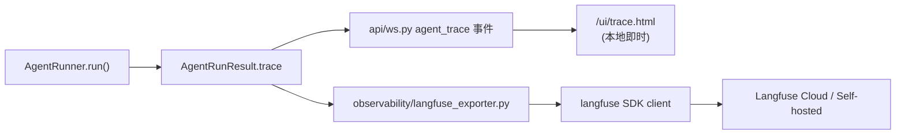

# Phase 10 — Langfuse 可观测性接入

> **上游：** [`minibot-fastapi-migration.md`](../migration.md) Phase 10、[`minibot-core-impact.md`](./minibot-core-impact.md) Phase 10 表格
> **前置：** Phase 0 完成（`AgentLoop` 是所有入口的统一收口点）
> **默认关闭：** 无 `LANGFUSE_SECRET_KEY` 时零开销、零行为差异
> **状态（2026-08-05）：** 旁路上报已落地（对接 mini-langfuse）。原计划的 `/ui/observability.html`（导出管道自检页）**已取消**——跨会话观察用 Langfuse UI，当轮用 `/ui/trace.html`。

本文把 Phase 10 从一句话展开为可执行的细粒度步骤。

---

## 1. Context — 为什么要做

### 1.1 现状

`AgentRunner.run()` 已经在 [`minibot/src/minibot/agent/runner.py:80-231`](../minibot/src/minibot/agent/runner.py) 生成一份结构化 trace：`prepare` / `llm_request` / `llm_tool_calls` / `tool_result` / `llm_final` / `llm_error` / `done`。它经 [`api/ws.py`](../minibot/src/minibot/api/ws.py) 的 `agent_trace` 事件送到前端，由 [`static/devui/trace.html`](../minibot/src/minibot/static/devui/trace.html) 展示。

**局限：**

- 进程重启即丢，跨会话无法回看
- 无 token 统计 / 成本聚合 / 失败率仪表盘
- 生产多用户环境无统一观察面

### 1.2 目标

1. **Dev UI 与 Langfuse 并存**：本地当轮问题看 Dev UI（即时、零依赖），跨会话/生产看 Langfuse
2. **默认关闭**：无 env 时不 import langfuse、无网络行为
3. **不动 Runner 合同**：作为 `AgentRunResult.trace` 的**旁路翻译层**，不侵入 ReAct 循环
4. **对齐 nanobot**：沿用 `LANGFUSE_SECRET_KEY` / `LANGFUSE_PUBLIC_KEY` / `LANGFUSE_HOST` 官方裸变量，用户从 nanobot 迁移零成本

### 1.3 预期结果

开启配置后跑一轮带工具的 turn，Langfuse UI 可以看到：

```text
Trace: session=<session_id> user=<token_hash>
└── Span "agent.turn"                          input=user_message, output=final_content
    ├── (metadata: model, temperature, tool_names, system_injected)
    ├── Generation "llm.iteration.1"           input=messages, output=tool_calls
    ├── Span "tool.echo"                       input=arguments, output=result(≤4KB)
    ├── Generation "llm.iteration.2"           input=messages+tool_result, output=final
    └── (metadata: stop_reason, iterations_used, tools_used)
```

关闭配置时：`AgentRunResult.trace` 仍生成，Dev UI 正常工作，langfuse 包不被 import。

---

## 2. Langfuse 快速科普

### 2.1 核心概念

Langfuse 是开源 LLM 可观测平台（Cloud + Self-hosted）。

| Langfuse 概念 | 类比 | minibot 对应 |
|---------------|------|--------------|
| **Trace** | 一次完整业务操作 | 一次 `AgentLoop.handle_turn`（一轮对话） |
| **Span** | trace 中的一个步骤 | `prepare` / `tool_result` 等 |
| **Generation** | 一次 LLM 调用（特殊 span，自带 model/token/cost 字段） | `llm_request` + 该轮响应 |
| **Session** | 关联多个 trace | minibot `session_id` |
| **User** | 触发者 | bootstrap token 派生的 `user_id` |
| **Score** | 事后打分 | 可选：`stop_reason==error` 自动记 0 分 |

一条 trace 是**树**：`trace → span/generation → 子 span`。

### 2.2 三种接入方式对比

Python SDK v3（2025-06 GA，基于 OpenTelemetry）：

| 方式 | 侵入度 | 是否采用 | 说明 |
|------|--------|----------|------|
| **A. Drop-in OpenAI wrapper** `from langfuse.openai import AsyncOpenAI` | 低 | ❌ | minibot 用 httpx 不用 openai SDK |
| **B. `@observe()` 装饰器**：函数上加装饰器自动捕获 I/O | 低-中 | 🟡 辅助 | 用于 Loop/Tool 层的粗粒度 span |
| **C. 手动 `start_as_current_span/generation()`** 显式建 span | 中 | ✅ 主路径 | 把 `AgentRunResult.trace` 翻译成 span 树 |

**决策**：C 为主 + B 辅助。理由：

- 现有 `AgentRunResult.trace` 已经是结构化步骤列表，翻译成 span 树是自然映射
- 与 provider 实现解耦，未来切成 openai SDK 时可无痛叠加 A
- SDK v3 基于 OTel，翻译层只依赖 `langfuse.Langfuse` 客户端

### 2.3 SDK v3 关键 API

```python
from langfuse import Langfuse

langfuse = Langfuse()  # 自动读 LANGFUSE_SECRET_KEY / LANGFUSE_PUBLIC_KEY / LANGFUSE_HOST

with langfuse.start_as_current_span(
    name="agent.turn",
    input={"user_message": content},
) as root:
    root.update_trace(
        session_id=session_id,
        user_id=user_id,
        tags=["minibot"],
    )
    with langfuse.start_as_current_generation(
        name="llm.iteration.1",
        model=model,
        input=messages,
        model_parameters={"temperature": 0.2},
    ) as gen:
        # 调 provider ...
        gen.update(output=response.content)

langfuse.flush()  # 进程退出前
```

参考：
- [Langfuse Python SDK v3](https://langfuse.com/docs/sdk/python/sdk-v3)
- [OpenAI Integration](https://langfuse.com/integrations/model-providers/openai-py)

---

## 3. Architecture

### 3.1 模块布局（新增）

```text
minibot/src/minibot/
  observability/                 ← 新建
    __init__.py
    langfuse_exporter.py         ← 核心翻译层
    trace_schema.py              ← 复用/校验 AgentRunResult.trace 的 step schema
```

### 3.2 数据流



**旁路翻译**：Loop 拿到 `AgentRunResult` 后，若 exporter 启用则翻译 trace 列表为 span 树并 flush，与 Dev UI 平级。

### 3.3 三种运行状态

| 状态 | 触发条件 | 行为 |
|------|----------|------|
| **完全关闭**（默认） | `LANGFUSE_SECRET_KEY` 未设 | exporter = no-op，`langfuse` 包**不 import** |
| **配置了但包未装** | env 已设，`langfuse` 未安装 | 启动日志 warning 一行，回退到关闭态 |
| **完全启用** | env 已设 + 包已装 | 每次 turn 结束翻译 trace 并异步 flush |

---

## 4. 分步实施（TDD 顺序）

### 4.1 依赖与配置

**改什么：**

`minibot/pyproject.toml` 增加 optional dependency：

```toml
[project.optional-dependencies]
observability = ["langfuse>=3.0.0,<4.0.0"]
```

安装：`pip install -e '.[observability]'`

**env 变量**（不加 `MINIBOT_SERVER_` 前缀，`Settings` 不新增字段）：

| 变量 | 用途 |
|------|------|
| `LANGFUSE_SECRET_KEY` | 触发开关 + SDK 鉴权 |
| `LANGFUSE_PUBLIC_KEY` | SDK 鉴权 |
| `LANGFUSE_HOST` | Langfuse 服务地址（SDK v3 官方名，取代早期 `LANGFUSE_BASE_URL`） |

**验收：**
- 无 env 时 `python -c "from minibot.app_state import build_app_state; build_app_state()"` 不触发 langfuse import
- 有 env 但未装 langfuse 时启动 warning 一行后正常运行

---

### 4.2 Exporter 骨架

新文件 `observability/langfuse_exporter.py`：

```python
"""Translate AgentRunResult.trace into Langfuse spans. No-op when disabled."""
from __future__ import annotations

import logging
import os
from typing import TYPE_CHECKING

if TYPE_CHECKING:
    from minibot.agent.runner import AgentRunResult

logger = logging.getLogger(__name__)


class LangfuseExporter:
    def __init__(self) -> None:
        self._client = None
        self._enabled = False
        if not os.environ.get("LANGFUSE_SECRET_KEY"):
            return
        try:
            from langfuse import Langfuse
        except ImportError:
            logger.warning(
                "LANGFUSE_SECRET_KEY is set but langfuse is not installed; "
                "install with `pip install 'minibot[observability]'` to enable tracing"
            )
            return
        self._client = Langfuse()
        self._enabled = True

    @property
    def enabled(self) -> bool:
        return self._enabled

    def export_turn(
        self,
        *,
        session_id: str,
        user_id: str | None,
        user_message: str,
        result: "AgentRunResult",
    ) -> None:
        if not self._enabled:
            return
        try:
            self._export_turn_inner(session_id, user_id, user_message, result)
        except Exception:
            logger.exception("Langfuse export failed; user request unaffected")

    async def flush(self) -> None:
        if self._client is not None:
            self._client.flush()
```

**接线：**
- `AppState` 增加 `self.exporter = LangfuseExporter()`
- `AgentLoop.handle_turn` 末尾调 `self.exporter.export_turn(...)`（**依赖 Phase 0.2 完成**）
- `main.py` lifespan `shutdown` 调 `await state.exporter.flush()`

**验收：**
- `LangfuseExporter()` 无 env 时 `enabled is False`，`export_turn` 直接 return
- mock env + mock `langfuse.Langfuse`：`enabled is True`，`export_turn` 被调用不抛错

---

### 4.3 Trace → Span 翻译核心

**映射规则**（`AgentRunResult.trace` step type → Langfuse 观测）：

| trace step type | Langfuse 观测 | input | output | metadata |
|-----------------|---------------|-------|--------|----------|
| `prepare` | 根 span 的 metadata（不单开 span） | — | — | model, temperature, max_iterations, tool_names, system_injected |
| `llm_request` + 下一个 `llm_tool_calls` / `llm_final` / `llm_error` 配对 | **Generation** `llm.iteration.<n>` | `messages` 快照 | content 或 tool_calls 或 error 文本 | iteration, finish_reason |
| `tool_result` | **Span** `tool.<name>` | `arguments` | `result`（截断 4KB） | tool_call_id, iteration |
| `done` | 根 span 的 output + trace metadata | — | `content` | stop_reason, iterations_used, tools_used |

**核心翻译（骨架）：**

```python
def _export_turn_inner(self, session_id, user_id, user_message, result):
    from minibot.observability.trace_schema import group_generations, truncate

    with self._client.start_as_current_span(
        name="agent.turn",
        input={"user_message": truncate(user_message, 2000)},
    ) as root:
        root.update_trace(
            session_id=session_id,
            user_id=user_id,
            tags=["minibot"],
        )
        prepare = next((s for s in result.trace if s["type"] == "prepare"), None)
        if prepare:
            root.update(metadata={
                "model": prepare.get("model"),
                "temperature": prepare.get("temperature"),
                "max_iterations": prepare.get("max_iterations"),
                "tools_offered": prepare.get("tool_names", []),
                "system_injected": prepare.get("system_injected", False),
            })

        for gen in group_generations(result.trace):
            with self._client.start_as_current_generation(
                name=f"llm.iteration.{gen.iteration}",
                model=gen.model,
                input=gen.input_messages,
                model_parameters={"temperature": gen.temperature},
            ) as g:
                if gen.error:
                    g.update(
                        output=gen.error,
                        level="ERROR",
                        status_message=gen.error,
                        metadata={"finish_reason": gen.finish_reason},
                    )
                else:
                    g.update(
                        output=gen.output,
                        metadata={"finish_reason": gen.finish_reason},
                    )
            for tool in gen.tools:
                with self._client.start_as_current_span(
                    name=f"tool.{tool.name}",
                    input=tool.arguments,
                    metadata={"tool_call_id": tool.call_id, "iteration": gen.iteration},
                ) as t:
                    t.update(output=truncate(tool.result, 4000))

        root.update(
            output={"content": result.content},
            metadata={
                "stop_reason": result.stop_reason,
                "iterations_used": _final_iterations(result.trace),
                "tools_used": result.tools_used,
            },
        )
        if result.stop_reason == "error":
            root.score(name="turn_success", value=0)
```

**辅助 `trace_schema.py`：**

- `group_generations(trace) -> list[GenerationRecord]`：遍历 trace，按 `iteration` 字段分组，把 `llm_request` 配到同 iteration 的 `llm_tool_calls` / `llm_final` / `llm_error`，同 iteration 的 `tool_result` 挂上
- `truncate(text, limit) -> str`：单个 payload > `limit` 时截断，尾部追加 `…(+N chars)`
- `GenerationRecord` / `ToolRecord`：`dataclass(slots=True, frozen=True)`

**验收：**
- 单测 fixture：`prepare + 2 iterations（第一轮 tool_call，第二轮 final）+ done` → mock Langfuse，断言：
  - 1 个根 span `agent.turn`
  - 2 个 generation
  - 1 个 tool span
  - `session_id` / `user_id` 正确
- fixture：`llm_error` → generation.level == "ERROR"，root.score 被调
- fixture：`tool_result.result` 长 50KB → 上送 payload ≤ 4KB

---

### 4.4 User ID / Session ID 语义

- **Session ID**：直接用 minibot 的 `session_id`（chat_id），Langfuse UI 会自动聚合到 Sessions 页
- **User ID**：
  - 有 bootstrap token：`user_id = "token:" + sha256(token)[:12]`（避免泄露）
  - 匿名：`user_id = "anonymous"`
  - 未来 Phase 6 引入 pairing/多用户后切真实用户

**验收：**
- 单测：不同 token 得到不同 user_id 前缀；同一 token 稳定复现

---

### 4.5 错误路径（关键约束）

| 情形 | 处理 |
|------|------|
| LLM 错误（`stop_reason=error`） | generation 加 `level="ERROR"`，root 打 `score(name="turn_success", value=0)` |
| 工具异常（Runner 已捕获，装到 tool return） | tool span 的 `output` 记录错误字符串，不额外开 error span |
| Exporter 自身翻译报错 | `try/except Exception: logger.exception(...)` 整块吞掉，**绝不影响用户对话** |
| Langfuse SDK 网络故障 | SDK v3 内部异步 flush 自己处理重试；`export_turn` 内不 await 网络 |

**验收：**
- 单测：mock `Langfuse` 客户端 `start_as_current_span` 抛异常 → `export_turn` 静默吞掉，返回 None
- 单测：`AgentRunResult.content` 与 exporter 是否启用无关

---

### 4.6 性能与关闭路径

**默认关闭时的零开销：**
- `LangfuseExporter.__init__` 早退（无 env）
- `export_turn` 首行 `if not self._enabled: return`
- 单测：hot-path benchmark 100 次 `export_turn(disabled)` < 1 ms

**开启时的开销控制：**
- 每 span 的 input/output 超 4KB 截断（Langfuse 服务端有 payload 上限，也避免大 grep 输出撑爆）
- SDK v3 默认异步批量 flush；turn 内不 `flush()`；只在 lifespan shutdown 强制 flush
- flush 超时兜底：`asyncio.wait_for(..., timeout=5.0)`

**验收：**
- 手动：开启态连打 50 条消息，观察 uvicorn 无异常、Langfuse UI 全部到达
- 单测：单个 tool result 50KB → 上送 payload ≤ 4KB（含截断标记）

---

### 4.7 Dev UI 与 Langfuse 分工

| 场景 | 用哪个 |
|------|--------|
| 本地开发、当前 turn 出问题立刻回看 | Dev UI `/ui/trace.html` |
| 跨会话对比、成本分析、失败率仪表盘 | Langfuse |
| 生产环境（多用户、24/7） | Langfuse（Dev UI 可默认关） |
| 无外网 / 私有数据 | Dev UI + 自托管 Langfuse |

**不做**：不从 Langfuse 反拉数据给 Dev UI（保持独立数据源，Dev UI 依赖 `AgentRunResult.trace`）。

---

### 4.8 文档同步

**产品文档 `docs/`：**
- 新建 `docs/observability.md`：用户视角接入 recipe（安装 extras、env、Cloud vs 自托管、FAQ）
- `docs/troubleshooting.md`：追加 minibot Langfuse 排查（三种状态 → 用户可见现象）
- `docs/README.md`：目录加 Observability 链接

**工程文档 `docs/`：**
- 本文件：Phase 10 权威计划
- [`minibot-fastapi-migration.md`](../migration.md) Phase 10：改写为摘要 + 指向本文件
- [`minibot-core-impact.md`](./minibot-core-impact.md) Phase 10 表格：无需大改（`M-Cfg` 不动，因不加 env prefix；`M-Runner` 不动，因走旁路翻译）

---

## 5. 目标文件清单

**新建：**

| 路径 | 说明 |
|------|------|
| `minibot/src/minibot/observability/__init__.py` | 导出 `LangfuseExporter` |
| `minibot/src/minibot/observability/langfuse_exporter.py` | 核心翻译层 |
| `minibot/src/minibot/observability/trace_schema.py` | `group_generations` / `truncate` / dataclass |
| `minibot/tests/test_langfuse_exporter.py` | 单测 |
| `docs/observability.md` | 用户视角接入文档 |

**修改：**

| 路径 | 内容 |
|------|------|
| `minibot/pyproject.toml` | `[project.optional-dependencies].observability = ["langfuse>=3.0.0,<4.0.0"]` |
| `minibot/src/minibot/app_state.py` | 初始化 `exporter: LangfuseExporter` |
| `minibot/src/minibot/agent/loop.py` | **Phase 0.2 完成后**：`handle_turn` 末尾调 `exporter.export_turn(...)` |
| `minibot/src/minibot/main.py` | lifespan shutdown 调 `await state.exporter.flush()` |
| `docs/README.md` / `docs/troubleshooting.md` | 追加 observability 章节 |
| `docs/migration.md` | Phase 10 改写为摘要 |

**可复用的现有实现：**

- [`agent/runner.py:52-57`](../minibot/src/minibot/agent/runner.py) — `AgentRunResult.trace` 是输入源，字段稳定
- [`nanobot/providers/openai_compat_provider.py:432-441`](../nanobot/providers/openai_compat_provider.py) — Langfuse 存在性检测的现成写法（`importlib.util.find_spec("langfuse")`）
- `(legacy nanobot configuration.md removed)` — Langfuse 章节可写入 `docs/phases/phase-10-langfuse.md` / 未来 observability 页

---

## 6. Testing Strategy

| 层次 | 内容 | 位置 |
|------|------|------|
| **单元** | Exporter enabled/disabled 状态机；trace → span 翻译；错误路径；截断 | `tests/test_langfuse_exporter.py` |
| **契约** | mock `Langfuse` 客户端，断言 span 树形状（span 数、name、input/output、metadata） | 同上 |
| **回归** | 无 env 时现有 `pytest` 全绿；`AgentRunResult` 行为不变 | `pytest`（现有） |
| **集成**（可选） | 用 Langfuse 官方 test project 跑真实调用，PR 附 UI 截图 | 手动 |

**关键 fixture（追加到 `tests/conftest.py`）：**

```python
@pytest.fixture
def fake_trace():
    """Deterministic AgentRunResult.trace: prepare + 2 iterations + done."""
    return [
        {"type": "prepare", "model": "gpt-4o-mini", "temperature": 0.2,
         "max_iterations": 8, "message_count": 2, "tool_names": ["echo"],
         "system_injected": True, "messages": [...]},
        {"type": "llm_request", "iteration": 1, "model": "gpt-4o-mini",
         "message_count": 2, "tools_offered": ["echo"], "messages": [...]},
        {"type": "llm_tool_calls", "iteration": 1, "assistant_content": None,
         "tool_calls": [{"id": "c1", "name": "echo", "arguments": {"text": "hi"}}]},
        {"type": "tool_result", "iteration": 1, "tool_call_id": "c1",
         "name": "echo", "arguments": {"text": "hi"}, "result": "hi"},
        {"type": "llm_request", "iteration": 2, "model": "gpt-4o-mini",
         "message_count": 4, "tools_offered": ["echo"], "messages": [...]},
        {"type": "llm_final", "iteration": 2, "finish_reason": "stop", "content": "done"},
        {"type": "done", "stop_reason": "completed", "iterations_used": 2,
         "tools_used": ["echo"], "content": "done", "final_messages": [...]},
    ]
```

---

## 7. Verification（端到端验收）

### 7.1 开启态

```bash
cd minibot
pip install -e '.[observability]'
export LANGFUSE_SECRET_KEY=sk-lf-...
export LANGFUSE_PUBLIC_KEY=pk-lf-...
export LANGFUSE_HOST=https://cloud.langfuse.com
minibot
```

用 WebUI 或 curl 打一条带工具的消息：

- Langfuse UI → **Traces**：能看到 `agent.turn` 根 span，展开有 generation + tool span
- Langfuse UI → **Sessions**：同一 `session_id` 的多条 turn 自动聚合

### 7.2 关闭态

```bash
unset LANGFUSE_SECRET_KEY
cd minibot && pytest    # 全绿
python -c "from minibot.app_state import build_app_state; build_app_state()"  # 无 ImportError, 无 langfuse import
```

### 7.3 降级态

```bash
pip uninstall langfuse -y
export LANGFUSE_SECRET_KEY=sk-lf-...
minibot                 # 启动日志一行 warning, 功能正常
```

---

## 8. Non-goals（本 Phase 明确不做）

- ❌ 通用 OpenTelemetry exporter（Jaeger / Tempo / Datadog）—— Phase 11+，SDK v3 已基于 OTel，加个 exporter 即可
- ❌ 前端埋点（WebUI 用户交互轨迹）
- ❌ Langfuse Prompt Management / Evaluation / Dataset（读侧功能）
- ❌ 除 error 外的自动质量评分
- ❌ Cron / Automations 触发的 turn 单独打 tag —— Phase 4 完成后再加 metadata
- ❌ 切 provider 走 `langfuse.openai` wrapper —— 本 Phase 之后可作为独立优化，两条路径不冲突

---

## 9. Risk & Rollback

| 风险 | 缓解 |
|------|------|
| Langfuse SDK 升级破坏兼容 | 锁 `langfuse>=3.0.0,<4.0.0`；exporter 只用稳定 API |
| 网络阻塞影响用户 | SDK v3 异步 flush；`export_turn` 内不 await 网络；shutdown flush 有超时 |
| 大 payload 打爆 quota | 单 span I/O ≤ 4KB 截断；`LANGFUSE_OBSERVE_DECORATOR_IO_CAPTURE_ENABLED=false` 兜底 |
| trace 字段演化导致翻译层失效 | `trace_schema.py` 用 `.get()` 容错；未知 step type 记 warning 不抛异常 |

**回滚**：删除 exporter 初始化行 + optional dep，Dev UI 与 Runner 完全不受影响。

---

## 10. 参考

- [Langfuse Python SDK v3](https://langfuse.com/docs/sdk/python/sdk-v3) — `@observe`、`start_as_current_span`、`start_as_current_generation`
- [Langfuse OpenAI Integration](https://langfuse.com/integrations/model-providers/openai-py) — drop-in wrapper（未采用，作为参考）
- nanobot `(removed)` Langfuse Observability 章节
- nanobot [`providers/openai_compat_provider.py`](../nanobot/providers/openai_compat_provider.py) Langfuse 存在性检测的现成实现
