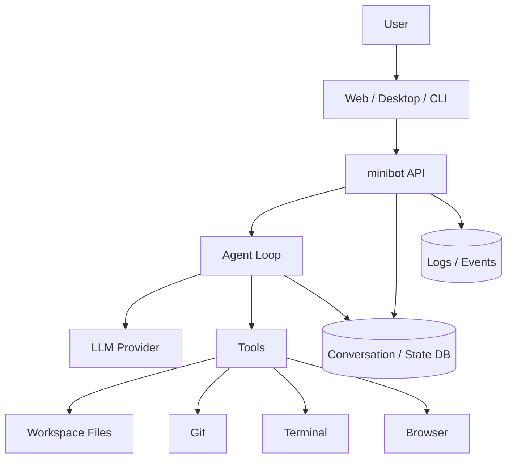
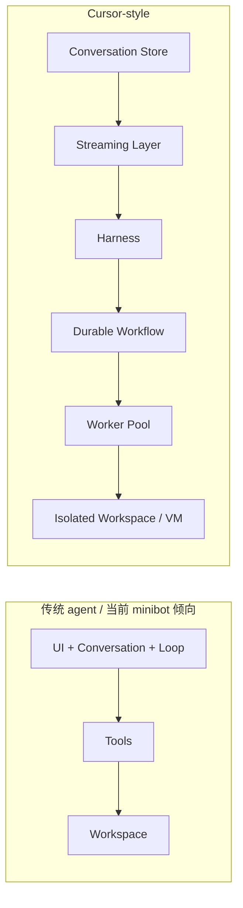
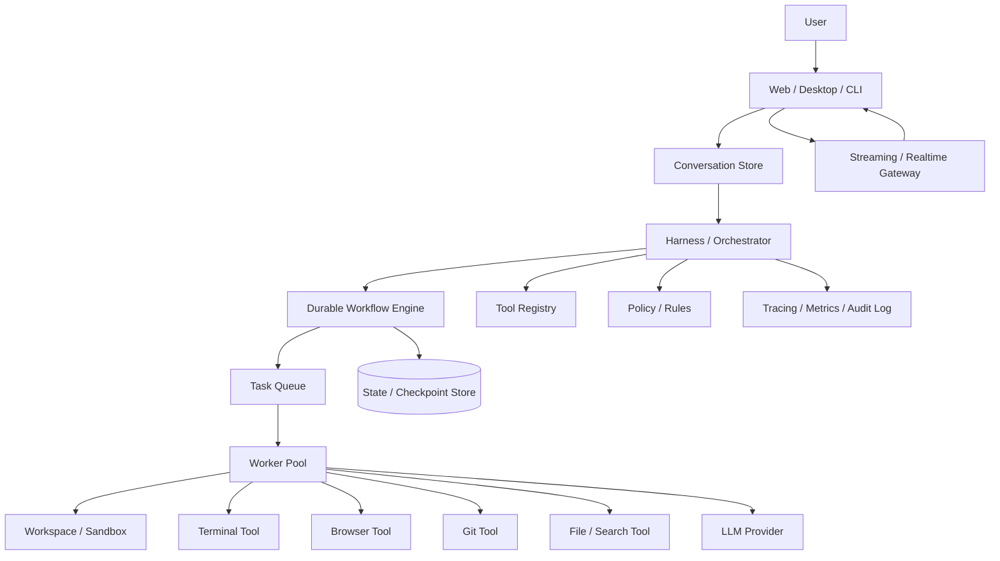
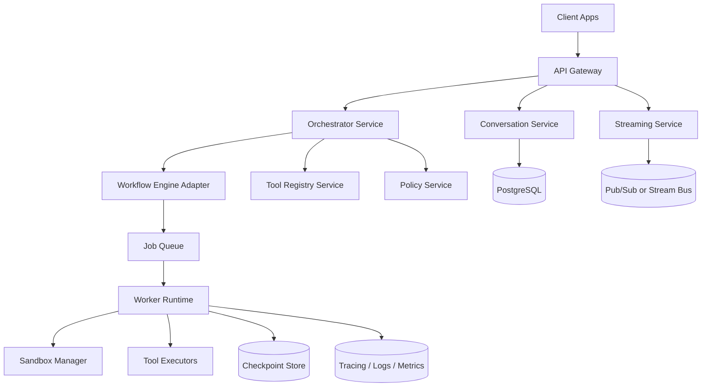
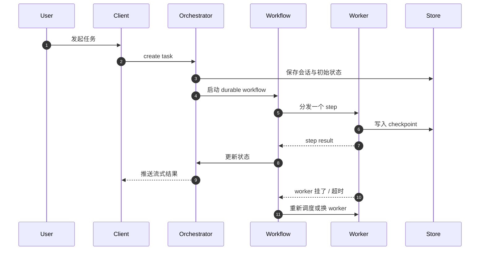
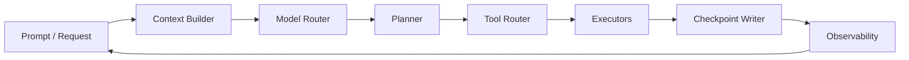
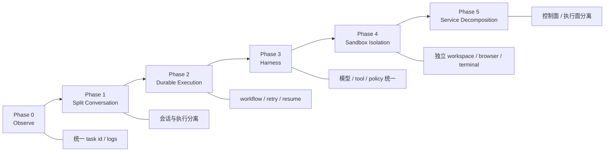

# minibot Cursor-style 架构重构草案

> 目标：把 minibot 从“单体式 agent 应用”演进成“可持续执行、可扩展、可重试、可观测”的 Cursor-style 架构。

## 1. 这份文档在讲什么

这份设计把四件事放在一起看：

- Cursor-style 架构到底和传统 coding agent 有什么差别
- minibot v2 应该长什么样
- durable execution、harness、worker pool 为什么是核心
- 从当前 minibot 走到目标架构的迁移路线怎么安排

一句话总结：

- 不是把 LLM 再包一层工具调用
- 而是把“会话、执行、环境、任务调度、工具路由”拆开
- 让 agent 运行像一个真正的分布式系统

## 2. 先看当前 minibot 架构

下面是一个偏保守的当前形态推断，方便我们对比重构方向。

### 当前架构的典型特征

- 会话和执行耦在一起
- agent loop 直接跑在业务服务里，容易互相影响
- 工具调用和调度逻辑混在一起
- 重试、回滚、恢复往往要靠应用自己补
- 单个 worker 或进程出问题时，状态恢复成本高

### 当前架构的主要问题

- 难并发：多个任务同时跑时容易抢资源
- 难恢复：进程挂掉后，loop 的中间态不一定能找回
- 难扩展：工具越来越多后，主流程会越来越臃肿
- 难观测：日志有了，但很难回答“这个任务为什么卡住”

## 3. Cursor-style 架构给我们的启发

Cursor 最值得借鉴的不是“用了 VM”，而是把系统拆成了几层：

- Conversation Store
- Streaming / UI 层
- Harness
- Durable Workflow / Agent Loop
- Workspace / Machine Environment
- Worker / Runner Pool

这意味着：

- UI 可以和执行解耦
- 执行可以重试和迁移
- 环境可以隔离
- 工具可以标准化接入

### Cursor-style 对比图

### 关键差异

- 当前模式更像“一个程序在做所有事”
- Cursor-style 更像“一个系统在调度多个可恢复任务”
- 当前模式把失败当异常
- Cursor-style 把失败当常态，并把恢复机制设计进去

## 4. minibot v2 目标架构

### 设计原则

- 会话和执行分离
- 执行必须可重试、可恢复、可追踪
- 工具调用必须经过统一 harness
- worker pool 负责执行，控制面负责调度
- 环境必须隔离，避免互相污染

### 目标架构图

### 这层拆分分别负责什么

- `Conversation Store`
  - 保存消息、版本、回滚点、运行记录
- `Streaming / Realtime Gateway`
  - 只负责把执行中的结果推给前端
- `Harness / Orchestrator`
  - 负责规划、路由、策略、上下文组装
- `Durable Workflow Engine`
  - 负责重试、超时、补偿、跨机器恢复
- `Task Queue`
  - 负责削峰和 worker 分发
- `Worker Pool`
  - 负责执行具体任务，不承担全局状态
- `Workspace / Sandbox`
  - 负责隔离文件、依赖、进程和浏览器状态

## 5. 服务拆分建议

### 为什么要这样拆

- 控制面和数据面分离，系统更稳
- stream 不会被执行过程拖垮
- worker 可以水平扩容
- policy 和 tool registry 可以独立演进

### 推荐的服务边界

- `Conversation Service`
  - 对话、消息、版本、重试点
- `Orchestrator Service`
  - 接收任务，生成计划，调度 workflow
- `Streaming Service`
  - 面向 UI 的实时推送
- `Worker Runtime`
  - 真正执行 agent loop 和工具
- `Sandbox Manager`
  - 创建、销毁、恢复隔离环境

## 6. durable execution 怎么落地

这里的关键不是“把任务写进队列”这么简单，而是让每个关键状态都能恢复。

### 需要持久化的东西

- 输入消息
- 当前 plan
- 已执行的 tool calls
- 当前 workspace 指针
- checkpoint
- 失败原因
- 重试次数
- 用户是否触发 rewind

### 建议的执行模型

### durable execution 的收益

- worker 挂了不等于任务挂了
- 可以做自动重试
- 可以做 rewind 和 resume
- 可以把执行从 UI 生命周期里剥离

## 7. harness 应该包含什么

Harness 是这里最容易被低估的核心。

它不是一个简单的 wrapper，而是一个执行中枢。

### Harness 职责

- 选择模型
- 组装上下文
- 选择工具集
- 注入规则和 policy
- 决定是否允许写文件、开浏览器、跑终端
- 控制子 agent / subtask
- 做失败回退和策略降级

### Harness 结构

### Harness 的边界

- 不直接承担大规模执行
- 不直接持有所有任务状态
- 只做决策、编排、约束

## 8. worker pool 应该怎么设计

worker pool 的目标是把“执行”变成可弹性伸缩的能力。

### Worker 的职责

- 拉取任务
- 拉起 sandbox
- 执行 tool calls
- 把结果写回 checkpoint
- 在失败时把上下文交回 workflow

### Worker 的特性

- 无状态优先
- 失败可替换
- 可以水平扩容
- 资源配额清晰

### worker 池的常见分层

- `General Worker`
  - 处理普通 agent 任务
- `Browser Worker`
  - 专门跑网页自动化
- `Terminal Worker`
  - 专门跑 shell / tests / scripts
- `Review Worker`
  - 专门做 diff、lint、审查

## 9. 当前到目标的迁移路线

这部分建议不要一口气重写，而是按层抽离。

### Phase 0: 先观测

- 统一任务 ID
- 统一日志格式
- 增加 step / checkpoint 事件
- 先把状态流看清楚

### Phase 1: 把会话和执行拆开

- Conversation Service 独立
- Agent Loop 仍可先在原服务里执行
- 但状态写入必须走统一接口

### Phase 2: 引入 workflow / durable execution

- 任务改为 workflow 驱动
- 支持重试、超时、恢复
- worker 从单进程转成池化执行

### Phase 3: 引入 harness

- 模型路由统一
- 工具注册统一
- policy 可配置
- 子任务和主任务共享编排层

### Phase 4: Sandbox / workspace 隔离

- 每个任务一个独立 workspace
- 浏览器、终端、文件系统都隔离
- 资源回收自动化

### Phase 5: 全面服务化

- 控制面和执行面完全分离
- 各服务可以独立扩容
- UI 只关心会话和流式结果

## 10. 迁移阶段图

## 11. 推荐的落地顺序

如果我们要把 minibot v2 真正做出来，我建议顺序是：

1. 先补观测和 checkpoint
2. 再把 conversation store 从 execution loop 里拆出去
3. 引入 durable workflow
4. 再做 harness
5. 最后做 sandbox 和 worker pool 的全面扩容

这样做的好处是：

- 每一步都能交付
- 每一步都能回滚
- 每一步都不会要求一次性重写全部系统

## 12. 一句话版结论

minibot v2 不应该只是“更强的 agent”，而应该是：

- 有明确控制面的系统
- 有 durable execution 的任务执行层
- 有统一 harness 的工具编排层
- 有隔离 workspace 的 worker pool
- 有可渐进迁移的工程路径
